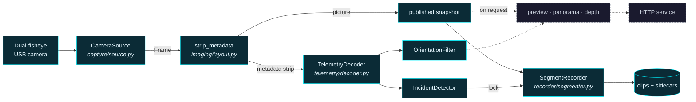
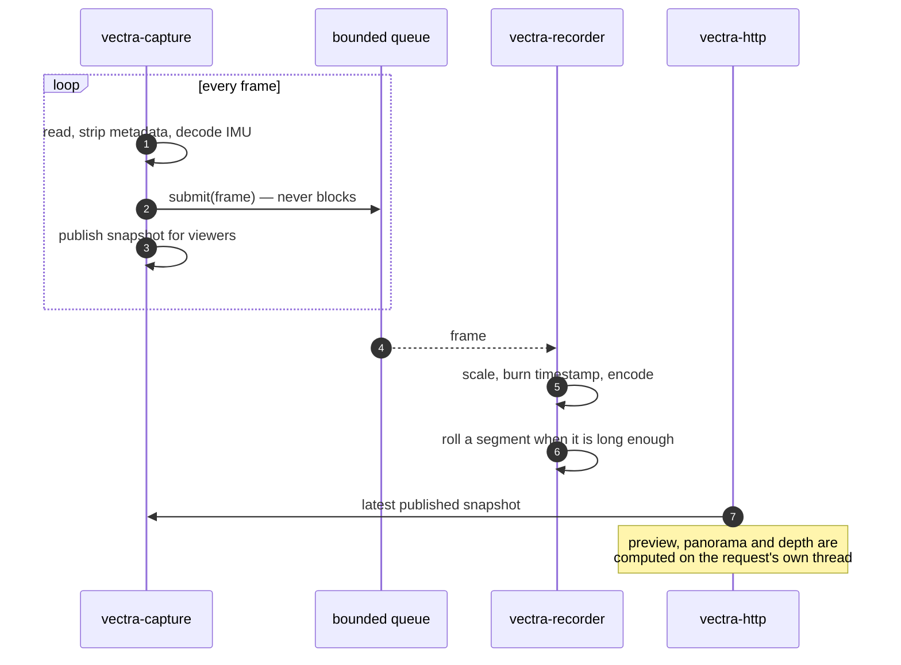
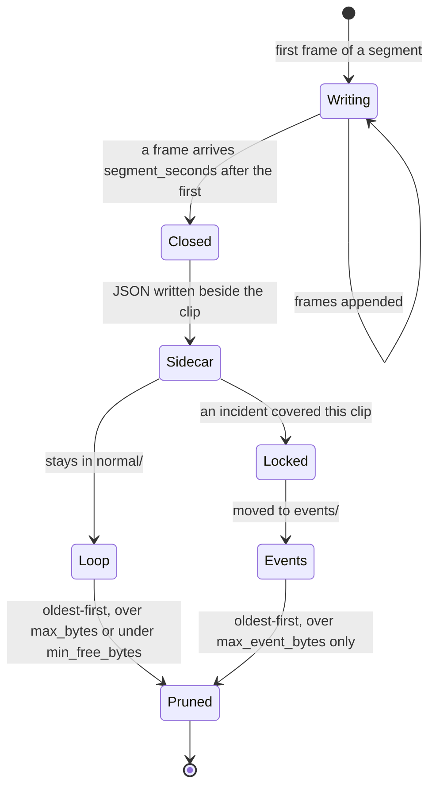
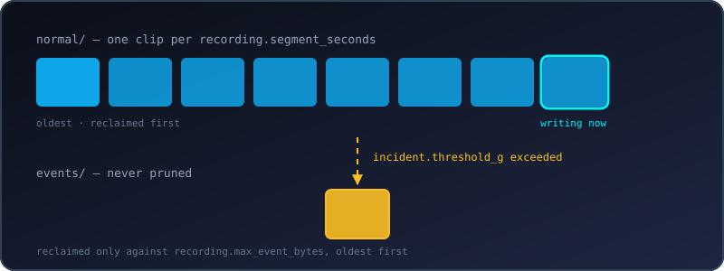
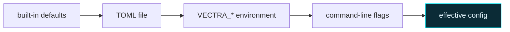

<div align="center">


**A dual-fisheye dashcam for the Raspberry Pi Compute Module 5, with stereoscopic depth on the side.**

[](https://github.com/Life-Experimentalist/Vectra-180/actions/workflows/ci.yml)
[](https://github.com/Life-Experimentalist/Vectra-180/actions/workflows/codeql.yml)
[](https://www.python.org/downloads/)
[](#hardware)
[](LICENSE.md)

[Install](#install) · [Use it](#use-it) · [How it works](#how-it-works) · [Configuration](#configuration) · [HTTP API](docs/api.md) · [Troubleshooting](docs/troubleshooting.md)

</div>

---

Vectra-180 turns a Compute Module 5 and a dual-fisheye USB camera into a dashcam
that records continuously, protects the footage around an impact, and serves the
whole thing to your phone over Wi-Fi. Because the camera has two lenses a fixed
distance apart, it can also compute a depth map — but that happens when you ask
for one, never while a clip is being written.

It runs headless as a systemd service, survives a camera that browns out on a
bumpy road, and never fills the SD card.

> [!NOTE]
> Nothing here is CM5-specific. It runs on any Linux, macOS or Windows machine
> with a UVC camera — the Pi is simply where it lives in a car. See
> [Hardware](#hardware) for what has actually been run, and on what.

<details>
<summary><b>Contents</b></summary>

- [Two rules](#two-rules)
- [What it does](#what-it-does)
- [Install](#install)
- [Use it](#use-it)
- [How it works](#how-it-works)
- [What a recording looks like](#what-a-recording-looks-like)
- [The web interface](#the-web-interface)
- [Configuration](#configuration)
- [Checking a machine](#checking-a-machine)
- [Documentation](#documentation)
- [Layout](#layout)
- [Development](#development)
- [Hardware](#hardware)
- [Questions](#questions)
- [Licence](#licence)

</details>

## Two rules

Everything in the codebase follows from these, and reading them first makes the
rest obvious.

**Recording is the duty.** Preview, depth, the panorama and the web UI are
optional; footage is not. Anything expensive is pushed off the capture thread, so
none of it can block a camera read or an encode — what a viewer, a slow card or a
depth request costs first is a preview frame. It cannot invent cores, though: on
a machine already at its limit they compete for CPU like anything else. Size
yours with `vectra180 doctor`, which measures the sustained rate with nobody
watching.

**The frame carries the clock.** Every frame arrives stamped with both a
monotonic time and a wall time. Pacing and segment length use the monotonic
one because it cannot jump; filenames and sidecars use the wall one. A Pi with
no RTC leaps forward the moment NTP settles, and that leap must not cut a clip
in half.

## What it does

| | |
|---|---|
| **Loop recording** | Fixed-length segments into a loop directory, pruned oldest-first against a size budget and a free-space floor. |
| **Incident lock** | The camera's IMU trips a threshold; the clip containing the moment is moved to `events/`, which the loop's pruning never touches — locked clips are reclaimed only against their own budget, oldest first. |
| **Telemetry** | The accelerometer and gyroscope block the camera embeds in each frame is decoded, filtered into roll/pitch/yaw, and written to a JSON sidecar beside every clip. |
| **Web interface** | Live MJPEG preview, clip browser, downloads, storage meter and a lock button — all from one self-contained page, no internet needed. |
| **Panoramic view** | Both eyes dewarped, joined and levelled on the horizon, on request. Clips stay raw. |
| **Depth on demand** | Stereo disparity from the two lenses, computed per request rather than per frame. |
| **`vectra180 doctor`** | Nine checks against the real capture and encode path — ending with five seconds of actual recording — each failure printed with the command that fixes it. |

## Install

### On a Raspberry Pi

Installs into `/opt/vectra180`, runs as an unprivileged `vectra` user, and starts
on boot.

```bash
git clone https://github.com/Life-Experimentalist/Vectra-180.git && sudo ./Vectra-180/deploy/install-pi.sh
```

Then check the machine over and watch it work:

```bash
sudo -u vectra /opt/vectra180/venv/bin/vectra180 doctor
```

The service listens on `127.0.0.1:8080` by default.

> [!WARNING]
> Reaching it from your phone needs a bind address **and** a token, not one or
> the other. Moving `server.host` off loopback without setting `server.token`
> puts your footage on the network for anyone else on it. See
> [Reaching it from a phone](deploy/README.md#10-reaching-it-from-a-phone).

Full hardware runbook, including camera choice, storage, power and thermals:
**[deploy/README.md](deploy/README.md)**.

<details>
<summary><b>From PyPI</b></summary>

> [!IMPORTANT]
> Not published yet. The release workflow builds and uploads on a version tag,
> and only when the repository variable `PUBLISH_TO_PYPI` is set to `true`, so
> this is what the command *will* be rather than what works today. Until then,
> install from a checkout.

```bash
pip install vectra-180
```

Add the desktop control panel with `pip install "vectra-180[desktop]"`. Leave it
out on a Pi — a headless recorder has no business installing a GUI toolkit.

</details>

<details>
<summary><b>As a container</b></summary>

> [!IMPORTANT]
> Not published yet either — the image is pushed to GHCR by the release
> workflow on a version tag, and no version has been tagged. `docker compose
> build` works from a checkout today; the pull below is what it *will* be.

```bash
docker run --rm --device /dev/video0 -p 127.0.0.1:8080:8080 -v vectra-footage:/recordings -e VECTRA_SERVER_TOKEN=choose-a-secret ghcr.io/life-experimentalist/vectra-180:1.0.0
```

Publishing the port to anything but `127.0.0.1` puts your footage on the network,
so set a token first. `docker-compose.yml` builds the image locally with the same
guards, and refuses to start without a token at all.

The image is built for `linux/amd64` and `linux/arm64` — the second is the one a
64-bit Raspberry Pi OS runs.

</details>

<details>
<summary><b>For development</b></summary>

```bash
git clone https://github.com/Life-Experimentalist/Vectra-180.git && cd Vectra-180 && ./install.sh
```

`install.ps1` does the same on Windows. Both install [uv](https://docs.astral.sh/uv/),
sync the environment, install the pre-commit hooks and run the checks. After
that, `make help` lists every task.

</details>

## Use it

```bash
vectra180 doctor          # can this machine record?
vectra180 devices         # what cameras are attached?
vectra180 run             # record and serve until stopped
vectra180 config          # what settings are actually in effect?
vectra180 decode shot.jpg # is there really an IMU block in this frame?
vectra180 view            # desktop control panel (needs the desktop extra)
```

`vectra` is installed as a shorter alias for the same command — `vectra doctor`
and `vectra180 doctor` are identical. From a checkout, prefix either with `uv
run` to use the project environment without activating it:

```bash
uv run vectra doctor
```

<details>
<summary><b>The flags worth knowing</b></summary>

Every subcommand takes `--config PATH`, `--camera N`, `--device PATH`,
`--backend NAME`, `--recording-dir PATH`, and `-v` / `-q`. `--camera` is an
index; `--device` is a path — passing a path to `--camera` will not work.

| Command | Also takes | For |
|---|---|---|
| `run` | `--duration SECONDS` | stop after a while instead of forever, which is how you take a test recording |
| | `--no-record` | serve the live view without writing clips |
| | `--no-serve` | record with no web interface at all |
| | `--host` `--port` `--token` | override the server without touching the config file |
| `devices` | `--max-index N` | how far up to probe |
| | `--json` | machine-readable |
| `doctor` | `--no-camera` | skip everything that needs hardware attached |
| | `--json` | machine-readable |
| `decode` | `--metadata-width PX` | how wide the metadata strip is on *this* module |
| | `--json` | machine-readable |
| `config` | `--json` | JSON instead of TOML |
| | `--show-secrets` | print the token instead of redacting it |
| | `--path` | also report which file was read, on stderr |

Every subcommand and flag in full: **[docs/cli.md](docs/cli.md)**.

</details>

## How it works

One thread owns the camera. Its loop is short on purpose — read, decode the
telemetry strip, hand the frame to the recorder, publish it for viewers — and
everything else hangs off the side.



Solid edges are the capture thread — the part that must never stall. Dashed
edges run on HTTP handler threads, only while someone is watching.

<details>
<summary><b>The three threads, and what separates them</b></summary>



The queue between the capture thread and the encoder is bounded twice over — by
frame count (two seconds of footage at the rate the clips declare) and by a byte
budget — and `submit()` never blocks. If the encoder cannot keep up, frames are dropped there
and counted, because a capture thread waiting on a full queue is a camera that
has stopped being read.

Dropped frames are not hidden: the count lands in the sidecar, `doctor` reports
it, and `/api/status` exposes it live.

</details>

<details>
<summary><b>What a segment goes through</b></summary>



A segment rolls on the timestamps of frames that *survived* the queue, not on
wall-clock time — so a machine that drops frames writes fewer, longer-covering
clips rather than silently truncating them. That is what `covers_seconds` in the
sidecar is for.

</details>

The full picture, including how a segment rolls over and what a sidecar
contains: **[docs/architecture.md](docs/architecture.md)**.

## What a recording looks like

<div align="center">

</div>

Clips are named from the wall clock at the first frame, and every clip gets a
sidecar of the same name:

```
recordings/
├── normal/
│   ├── VEC_20260811_182927.mp4
│   ├── VEC_20260811_182927.json
│   └── …
└── events/
    ├── VEC_20260811_181402.mp4
    └── VEC_20260811_181402.json
```

<details>
<summary><b>A real sidecar, from a real run</b></summary>

```json
{
  "clip": "VEC_20260811_182927.mp4",
  "started_at": "2026-08-11T18:29:27.131706+00:00",
  "duration_seconds": 41.385,
  "covers_seconds": 41.385,
  "dropped_frames": 0,
  "continuous": true,
  "frames": 538,
  "fps": 13.0,
  "width": 1992,
  "height": 600,
  "locked": false,
  "lock_reasons": [],
  "telemetry": []
}
```

Three fields are there to keep the clip honest about itself:

- **`duration_seconds`** — how long the file plays, which is `frames ÷ fps`.
- **`covers_seconds`** — how much real time passed while it was recorded.
- **`continuous`** — true only when nothing was dropped *and* the two figures
  agree. When they disagree, the footage is a time-lapse of the incident rather
  than a record of it, and you should know that before you rely on it.

`telemetry` is empty here because the module used for this run does not embed an
IMU block — see the `telemetry` check in [Checking a machine](#checking-a-machine).

</details>

Segments, sidecars, incidents and both storage budgets in full:
**[docs/recording.md](docs/recording.md)**.

## The web interface

`vectra180 run` serves a single self-contained page — no CDN, no internet, no
build step. It works on a phone parked next to the Pi with nothing else around.

<details>
<summary><b>Every route</b></summary>

| Method | Route | Returns |
|---|---|---|
| `GET` | `/healthz` | liveness and version, answered *before* auth so a supervisor never needs the operator's token |
| `GET` | `/` | the control page |
| `GET` | `/static/<file>` | its CSS and JS, served from inside the package |
| `GET` | `/snapshot.jpg` | one frame, JPEG |
| `GET` | `/stream.mjpg` | live preview, MJPEG, paced at `server.preview_fps` |
| `GET` | `/depth.jpg` | a stereo depth map, computed for this request |
| `GET` | `/api/status` | recording state, rate, dropped frames, attitude, uptime |
| `GET` | `/api/config` | the effective configuration, token redacted |
| `GET` | `/api/storage` | both budgets, what is used, what is free |
| `GET` | `/api/clips` | every clip, both categories, newest first |
| `GET` | `/api/clips/<name>` | the clip itself, as a download |
| `POST` | `/api/clips/<name>/protect` | move that clip into `events/` |
| `POST` | `/api/lock` | lock whatever is recording right now |
| `POST` | `/api/recording/start` | start writing clips |
| `POST` | `/api/recording/stop` | stop writing clips, keep serving the preview |
| `DELETE` | `/api/clips/<name>` | delete a clip and its sidecar |

`/snapshot.jpg` and `/stream.mjpg` take `?view=pano` for the joined, levelled
panorama and `?overlay=0` to drop the HUD. When `server.token` is set, every
route except `/healthz` requires it — as an `Authorization` header or, because a
`<video>` tag cannot send headers, as `?token=`.

Parameters, response shapes and status codes: **[docs/api.md](docs/api.md)**.

</details>

## Configuration

Settings resolve in four layers, each overriding the last.



```toml
# /etc/vectra180/config.toml

[camera]
device = "/dev/video0"
width = 2560          # both fisheye views side by side; 0/0 = whatever
height = 720          # mode the driver opens in
fps = 30

[recording]
segment_seconds = 60
max_bytes = 34359738368       # 32 GiB of loop footage
min_free_bytes = 2147483648   # never fill the card past this
max_event_bytes = 8589934592  # 8 GiB reserved for locked clips

[incident]
threshold_g = 0.6     # deviation from rest that counts as an impact

[server]
host = "127.0.0.1"    # 0.0.0.0 reaches your phone -- and everyone else's
token = ""            # set this before you change the line above
```

`vectra180 config` prints the merged result with the token redacted, and
`vectra180 config --path` also says which file it read.

<details>
<summary><b>Where the file lives, and the settings worth reaching for first</b></summary>

With no `--config` and no `VECTRA_CONFIG`, the platform config directory is used:

| | |
|---|---|
| Linux | `/etc/vectra180/config.toml` when it exists — which is where the Pi installer puts it — otherwise `~/.config/vectra180/config.toml` |
| macOS | `~/Library/Application Support/Vectra180/config.toml` |
| Windows | `%APPDATA%\Vectra180\config.toml` |

The four that fix most problems:

| Setting | Environment variable | Reach for it when |
|---|---|---|
| `recording.fps` | `VECTRA_RECORDING_FPS` | the machine cannot sustain the camera's rate — this is the rate the clip *declares*, so setting it makes the footage real time again |
| `recording.scale` | `VECTRA_RECORDING_SCALE` | encoding a full-size stereo frame is the bottleneck |
| `camera.fourcc` | `VECTRA_CAPTURE_FOURCC` | the module will not deliver its full rate; `MJPG` suits most, a few need `""` |
| `telemetry.metadata_width` | `VECTRA_METADATA_WIDTH` | your module writes a differently sized block into the frame's leading columns |

Every key, every default, every environment variable and every validation rule:
**[docs/configuration.md](docs/configuration.md)**.

</details>

## Checking a machine

`vectra180 doctor` does not read the configuration and tell you what it says. It
opens the camera, decodes what it sends, encodes it, and records for five
seconds — then reports what actually happened, with the fix beside each problem.

| Check | What it proves |
|---|---|
| `environment` | the versions actually loaded — Python, OpenCV, NumPy, the OS |
| `devices` | which indices open, at what size, on which backend — and which open but never deliver a frame |
| `camera` | the configured camera opens, and the rate it *really* sustains |
| `telemetry` | whether an IMU block can be decoded out of those frames |
| `ffmpeg` | where the encoder binary is |
| `storage` | free space, and what the two budgets are holding |
| `encoder` | how fast the writer encodes frames of the size you will record |
| `pipeline` | five seconds of real recording — capture, prepare and encode together |
| `service` | the bind address, and whether a token guards it |

Warnings do not fail the run; failures set a non-zero exit status, so it can gate
a deployment. `--no-camera` skips everything that needs hardware, and `--json`
makes it machine-readable.

<details>
<summary><b>What a good run looks like</b></summary>

From a dual-fisheye UVC module on a Windows development machine, at half scale
and a declared 13 fps:

```
[ ok ] environment: vectra180 1.0.0 on Windows AMD64, python 3.12.10, opencv 5.0.0, numpy 2.5.1
[ ok ] ffmpeg: ...\ffmpeg-9.0-full_build\bin\ffmpeg.EXE
[ ok ] storage: C:\Users\...\Videos\Vectra180: 198.1 GB free, 8 loop clip(s), 0 locked clip(s)
[ ok ] service: http://127.0.0.1:8080 (loopback only, no token)
[warn] devices: msmf[0] Camera 0 (index 0) 640x480 -- no frames; msmf[1] Camera 1 (index 1) 4000x1200; ...
         -> the entries marked 'no frames' opened but streamed nothing, which usually means another program is holding them
[warn] camera: 4000x1200 via msmf, 16.5 fps measured (30 requested)
         -> the USB link or the pixel format is the bottleneck: camera.fourcc asked for MJPG and the driver will not say which format it settled on...
[warn] telemetry: no IMU block decoded from the metadata strip
         -> not every dual-fisheye module embeds this IMU block, and some write a different one into the same corner...
[ ok ] encoder: FFmpegWriter at 1984x600 preset 'ultrafast': 83.6 fps (30 needed)
[ ok ] pipeline: 13.0 fps captured, prepared and encoded together (13 requested), from a camera asked for 30

All critical checks passed with 3 warning(s).
```

Three warnings, and all three are the machine rather than the software: another
program is holding the laptop's own webcam, the USB link will not carry
4000×1200 at 30 fps, and this module does not embed an IMU block. The clips it
writes are real time and continuous, which is the part that matters.

</details>

Symptom by symptom: **[docs/troubleshooting.md](docs/troubleshooting.md)**.

## Documentation

| | |
|---|---|
| [Architecture](docs/architecture.md) | Threads, data flow, and why the pipeline is shaped this way. |
| [Configuration](docs/configuration.md) | Every setting, default, environment variable and validation rule. |
| [Recording and retention](docs/recording.md) | Segments, sidecars, incidents, and how the two storage budgets are enforced. |
| [Telemetry format](docs/telemetry.md) | The wire format of the IMU block, byte by byte. |
| [HTTP API](docs/api.md) | Every route, parameter and response shape. |
| [Command line](docs/cli.md) | Every subcommand and flag. |
| [Troubleshooting](docs/troubleshooting.md) | Symptoms, causes, fixes. |
| [Deployment runbook](deploy/README.md) | Hardware, wiring, power, thermals, phone access. |
| [Security posture](SECURITY.md) | What is protected, what is not, and how to report a flaw. |
| [Contributing](CONTRIBUTING.md) | How to work on this. |

## Layout

```
src/vectra180/
├── capture/     opening the camera, reading frames, reconnecting
├── imaging/     dewarp, stitch, stabilise, depth, HUD, frame layout
├── telemetry/   decoding the IMU block and filtering it into attitude
├── recorder/    segmenting, encoding, incidents, retention
├── service/     the HTTP service and its self-contained web UI
├── ui/          the optional DearPyGui desktop panel
├── config.py    the four-layer settings merge
├── engine.py    the capture thread everything else hangs off
├── doctor.py    the diagnostics
└── cli.py       the command line
```

## Development

```bash
make install    # environment and dev tools
make gate       # lint, typecheck, full suite -- exactly what CI runs
make test-fast  # skip the integration tests
```

`make help` lists all of them: `install`, `hooks`, `format`, `lint`,
`typecheck`, `test`, `test-fast`, `gate`, `doctor`, `run`, `view`, `build`,
`docker`, `clean`.

The suite runs without a camera and without a display: `FakeCameraSource` replays
synthetic frames, and a fake DearPyGui is substituted into `sys.modules` so the
desktop panel is exercised on a headless runner. Two markers narrow a run —
`integration` for the tests that drive real files and sockets, and `hardware`,
reserved for anything that would need a camera attached and excluded in CI.

See [CONTRIBUTING.md](CONTRIBUTING.md) before opening a pull request.

## Hardware

Built for:

- **Raspberry Pi Compute Module 5** on the CM5 IO board, Raspberry Pi OS Bookworm
- **A dual-fisheye USB (UVC) camera** delivering both views side by side in one frame

Where it has actually run: a dual-fisheye UVC module on a Windows development
machine, plus the full test suite on Linux, macOS and Windows in CI. The CM5 is
what the deployment runbook, the systemd unit and the encoder defaults are
designed around, but this release has not yet recorded a drive on one. Treat the
Pi instructions as tested-by-construction rather than road-proven, and see
[deploy/README.md § Verify](deploy/README.md#9-verify) for what to confirm on
your own board before trusting it.

If your camera works — or doesn't — please
[file a hardware report](https://github.com/Life-Experimentalist/Vectra-180/issues/new?template=hardware_report.yml)
so the next person knows what to buy.

## Questions

<details>
<summary><b>Do I need a special camera?</b></summary>

Any UVC camera records. The dual-fisheye part matters for two features: the
panorama needs both eyes in one frame, and depth needs them a known distance
apart. A single-lens webcam records and previews perfectly well — but both of
those views split the frame down the middle and assume the halves are two eyes,
so on one lens they produce nonsense rather than an error.

`vectra180 devices` lists what is attached and at what size; a module that
reports something like 2560×720 or 4000×1200 is delivering both views side by
side.

</details>

<details>
<summary><b>Why is the footage playing faster than real time?</b></summary>

Because the machine could not sustain the rate the clip declares. Run
`vectra180 doctor` and read the `pipeline` check: it measures capture, prepare
and encode together, and its remedy names the `recording.fps` to set. Once set,
the clips declare the rate the machine actually holds and play back in real time
— nothing is thrown away by setting it, because the frames were never captured.

</details>

<details>
<summary><b>Where does my telemetry go if the camera has no IMU?</b></summary>

The sidecar's `telemetry` array stays empty and incident locking has nothing to
trip on — everything else is unaffected. If your module does embed a block but
in a different width, set `telemetry.metadata_width`; `vectra180 decode` on a
still frame will tell you whether it is being read.

</details>

<details>
<summary><b>Can I reach it from my phone?</b></summary>

Yes, and it needs two changes together: `server.host` off loopback **and**
`server.token` set. The service will bind wherever you tell it, so setting the
first without the second serves your footage to everyone on the network. The
runbook walks through it: [Reaching it from a phone](deploy/README.md#10-reaching-it-from-a-phone).

</details>

<details>
<summary><b>Will it fill my card?</b></summary>

No. Loop footage is pruned oldest-first once it passes `recording.max_bytes` or
once free space drops below `recording.min_free_bytes`. Locked clips are exempt
from that and have a budget of their own, `recording.max_event_bytes`, pruned
oldest-first in turn — so a run of incidents cannot grow without bound either.

</details>

## Licence

Apache License 2.0. See [LICENSE.md](LICENSE.md).
