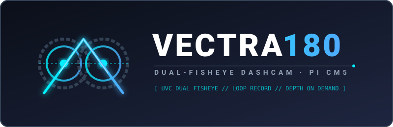
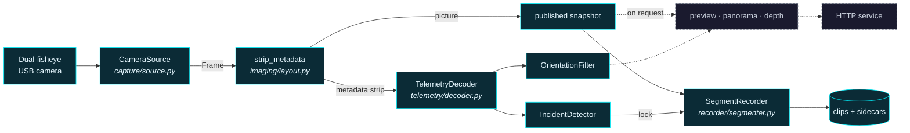

<div align="center">



**A dual-fisheye dashcam for the Raspberry Pi Compute Module 5, with stereoscopic depth on the side.**

[](https://github.com/Life-Experimentalist/Vectra-180/actions/workflows/ci.yml)
[](https://github.com/Life-Experimentalist/Vectra-180/actions/workflows/codeql.yml)
[](https://www.python.org/downloads/)
[](LICENSE.md)

[Install](#install) · [Documentation](docs/) · [Configuration](docs/configuration.md) · [HTTP API](docs/api.md) · [Troubleshooting](docs/troubleshooting.md)

</div>

---

Vectra-180 turns a Compute Module 5 and a dual-fisheye USB camera into a dashcam
that records continuously, protects the footage around an impact, and serves the
whole thing to your phone over Wi-Fi. Because the camera has two lenses a fixed
distance apart, it can also compute a depth map — but that happens when you ask
for one, never while a clip is being written.

It runs headless as a systemd service, survives a camera that browns out on a
bumpy road, and never fills the SD card.

## Two rules

Everything in the codebase follows from these, and reading them first makes the
rest obvious.

**Recording is the duty.** Preview, depth, the panorama and the web UI are
optional; footage is not. Anything expensive is pushed off the capture thread,
so a viewer, a slow card or a depth request can cost you a preview frame — never
a recorded one.

**The frame carries the clock.** Every frame arrives stamped with both a
monotonic time and a wall time. Pacing and segment length use the monotonic
one because it cannot jump; filenames and sidecars use the wall one. A Pi with
no RTC leaps forward the moment NTP settles, and that leap must not cut a clip
in half.

## What it does

| | |
|---|---|
| **Loop recording** | Fixed-length segments into a loop directory, pruned oldest-first against a size budget and a free-space floor. |
| **Incident lock** | The camera's IMU trips a threshold; the clip containing the moment is moved to `events/`, which the loop's pruning never touches — locked clips are reclaimed only against their own budget, oldest first. |
| **Telemetry** | The accelerometer and gyroscope block the camera embeds in each frame is decoded, filtered into roll/pitch/yaw, and written to a JSON sidecar beside every clip. |
| **Web interface** | Live MJPEG preview, clip browser, downloads, storage meter and a lock button — all from one self-contained page, no internet needed. |
| **Panoramic view** | Both eyes dewarped, joined and levelled on the horizon, on request. Clips stay raw. |
| **Depth on demand** | Stereo disparity from the two lenses, computed per request rather than per frame. |
| **`vectra180 doctor`** | Eight checks against the real capture and encode path, each failure printed with the command that fixes it. |

## Install

### On a Raspberry Pi

Installs into `/opt/vectra180`, runs as an unprivileged `vectra` user, and starts
on boot.

```bash
git clone https://github.com/Life-Experimentalist/Vectra-180.git && sudo ./Vectra-180/deploy/install-pi.sh
```

Then check the machine over and watch it work:

```bash
sudo -u vectra /opt/vectra180/venv/bin/vectra180 doctor
```

The service listens on `127.0.0.1:8080` by default. To reach it from your phone,
see [Reaching it from a phone](deploy/README.md#10-reaching-it-from-a-phone) — it
needs a bind address **and** a token, not one or the other.

Full hardware runbook, including camera choice, storage, power and thermals:
**[deploy/README.md](deploy/README.md)**.

### From PyPI

```bash
pip install vectra-180
```

Add the desktop control panel with `pip install "vectra-180[desktop]"`. Leave it
out on a Pi — a headless recorder has no business installing a GUI toolkit.

### As a container

```bash
docker run --rm --device /dev/video0 -p 127.0.0.1:8080:8080 -v vectra-footage:/recordings -e VECTRA_SERVER_TOKEN=choose-a-secret ghcr.io/life-experimentalist/vectra-180:1.0.0
```

Publishing the port to anything but `127.0.0.1` puts your footage on the network,
so set a token first. `docker-compose.yml` builds the image locally with the same
guards, and refuses to start without a token at all.

### For development

```bash
git clone https://github.com/Life-Experimentalist/Vectra-180.git && cd Vectra-180 && ./install.sh
```

`install.ps1` does the same on Windows. Both install [uv](https://docs.astral.sh/uv/),
sync the environment, install the pre-commit hooks and run the checks. After
that, `make help` lists every task.

## Use it

```bash
vectra180 doctor          # can this machine record?
vectra180 devices         # what cameras are attached?
vectra180 run             # record and serve until stopped
vectra180 config          # what settings are actually in effect?
vectra180 decode shot.jpg # is there really an IMU block in this frame?
vectra180 view            # desktop control panel (needs the desktop extra)
```

`vectra` is installed as a shorter alias for the same command — `vectra doctor`
and `vectra180 doctor` are identical. From a checkout, prefix either with `uv
run` to use the project environment without activating it:

```bash
uv run vectra doctor
```

Every subcommand and flag: **[docs/cli.md](docs/cli.md)**.

## How it works

One thread owns the camera. Its loop is short on purpose — read, decode the
telemetry strip, hand the frame to the recorder, publish it for viewers — and
everything else hangs off the side.



Solid edges are the capture thread — the part that must never stall. Dashed
edges run on HTTP handler threads, only while someone is watching.

The full picture, including how a segment rolls over and what a sidecar
contains: **[docs/architecture.md](docs/architecture.md)**.

## Configuration

Settings resolve in four layers, each overriding the last: built-in defaults, a
TOML file, `VECTRA_*` environment variables, then command-line flags.

```toml
# /etc/vectra180/config.toml

[camera]
device = "/dev/video0"
width = 2560          # both fisheye views side by side; 0/0 = whatever
height = 720          # mode the driver opens in
fps = 30

[recording]
segment_seconds = 60
max_bytes = 34359738368       # 32 GiB of loop footage
min_free_bytes = 2147483648   # never fill the card past this
max_event_bytes = 8589934592  # 8 GiB reserved for locked clips

[incident]
threshold_g = 0.6     # deviation from rest that counts as an impact

[server]
host = "127.0.0.1"    # 0.0.0.0 reaches your phone -- and everyone else's
token = ""            # set this before you change the line above
```

`vectra180 config` prints the merged result with the token redacted. Every key,
every default and every environment variable: **[docs/configuration.md](docs/configuration.md)**.

## Documentation

| | |
|---|---|
| [Architecture](docs/architecture.md) | Threads, data flow, and why the pipeline is shaped this way. |
| [Configuration](docs/configuration.md) | Every setting, default, environment variable and validation rule. |
| [Recording and retention](docs/recording.md) | Segments, sidecars, incidents, and how the two storage budgets are enforced. |
| [Telemetry format](docs/telemetry.md) | The wire format of the IMU block, byte by byte. |
| [HTTP API](docs/api.md) | Every route, parameter and response shape. |
| [Command line](docs/cli.md) | Every subcommand and flag. |
| [Troubleshooting](docs/troubleshooting.md) | Symptoms, causes, fixes. |
| [Deployment runbook](deploy/README.md) | Hardware, wiring, power, thermals, phone access. |
| [Security posture](SECURITY.md) | What is protected, what is not, and how to report a flaw. |
| [Contributing](CONTRIBUTING.md) | How to work on this. |

## Layout

```
src/vectra180/
├── capture/     opening the camera, reading frames, reconnecting
├── imaging/     dewarp, stitch, stabilise, depth, HUD, frame layout
├── telemetry/   decoding the IMU block and filtering it into attitude
├── recorder/    segmenting, encoding, incidents, retention
├── service/     the HTTP service and its self-contained web UI
├── ui/          the optional DearPyGui desktop panel
├── config.py    the four-layer settings merge
├── engine.py    the capture thread everything else hangs off
├── doctor.py    the diagnostics
└── cli.py       the command line
```

## Development

```bash
make install    # environment and dev tools
make gate       # lint, typecheck, full suite -- exactly what CI runs
make test-fast  # skip the integration tests
```

The suite runs without a camera and without a display: `FakeCameraSource` replays
synthetic frames, and a fake DearPyGui is substituted into `sys.modules` so the
desktop panel is exercised on a headless runner. Two markers narrow a run —
`integration` for the tests that drive real files and sockets, and `hardware`,
reserved for anything that would need a camera attached and excluded in CI.

See [CONTRIBUTING.md](CONTRIBUTING.md) before opening a pull request.

## Hardware

Built for:

- **Raspberry Pi Compute Module 5** on the CM5 IO board, Raspberry Pi OS Bookworm
- **A dual-fisheye USB (UVC) camera** delivering both views side by side in one frame

Where it has actually run: a dual-fisheye UVC module on a Windows development
machine, plus the full test suite on Linux, macOS and Windows in CI. The CM5 is
what the deployment runbook, the systemd unit and the encoder defaults are
designed around, but this release has not yet recorded a drive on one. Treat the
Pi instructions as tested-by-construction rather than road-proven, and see
[deploy/README.md § Verify](deploy/README.md#9-verify) for what to confirm on
your own board before trusting it.

Nothing is CM5-specific. It runs on any Linux, macOS or Windows machine with a
UVC camera; the Pi is simply where it lives in a car. If your camera works — or
doesn't — please [file a hardware report](https://github.com/Life-Experimentalist/Vectra-180/issues/new?template=hardware_report.yml)
so the next person knows what to buy.

## Licence

Apache License 2.0. See [LICENSE.md](LICENSE.md).
