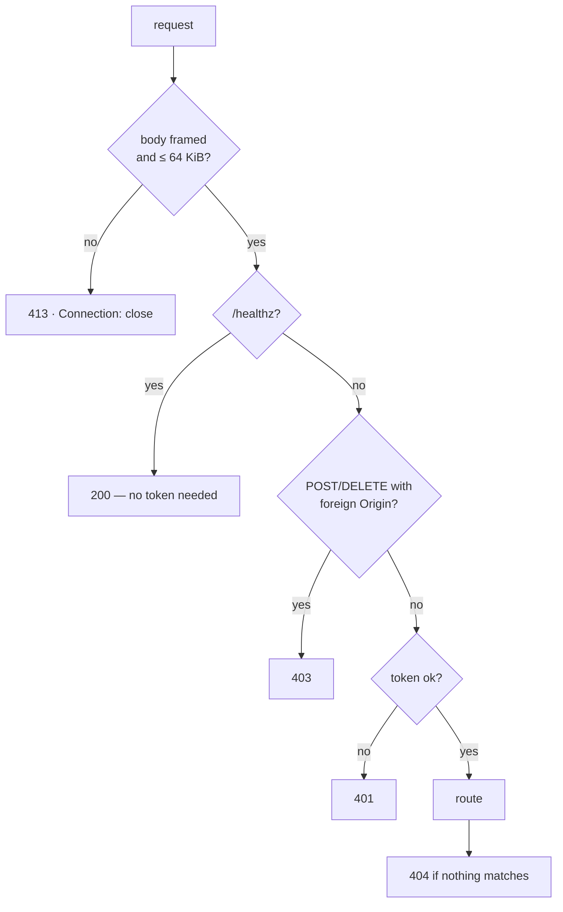

# HTTP API

Every route the service answers. The implementation is
[`service/app.py`](../src/vectra180/service/app.py) — a few hundred lines on the
standard library's `ThreadingHTTPServer`, with no web framework.

That is a deliberate choice: the Pi image stays at zero extra runtime
dependencies, the attack surface can be read in full in one sitting, and there is
no ASGI server competing with the encoder for CPU.

## Base URL and authentication

The service binds `127.0.0.1:8080` by default.

```bash
export VECTRA=http://127.0.0.1:8080
```

If `server.token` is set, every route except `/healthz` requires it, in either
of two forms:

```bash
curl -H "Authorization: Bearer $TOKEN" "$VECTRA/api/status"
curl "$VECTRA/api/status?token=$TOKEN"
```

The query form exists because `` and `<video>` elements cannot carry a
header, and a header-only scheme would make the preview unusable. It also means
the token lands in browser history — which is one more reason not to reuse a
password here.

Tokens are compared with `hmac.compare_digest`, so a wrong guess takes the same
time as a right one. A missing or wrong token gets `401` with
`WWW-Authenticate: Bearer realm="vectra180"`.

> With no token set, **anyone who can reach the port can read every clip you
> have recorded.** That is safe on loopback and nowhere else. `vectra180 doctor`
> fails its `service` check if `server.host` is public and `server.token` is
> empty.

### Cross-origin protection

`POST` and `DELETE` are refused with `403` when they carry an `Origin` header
that does not match `Host`. Without that, any page open in the driver's browser
could submit a form that stops the recording — and the default loopback bind has
no token standing in the way.

A browser attaches `Origin` to every cross-site request and a page cannot forge
it. Non-browser clients — curl, scripts — send none at all, which is why a
missing header is accepted.

### Response headers

Every response through the standard path carries:

```
X-Content-Type-Options: nosniff
Referrer-Policy: no-referrer
Content-Security-Policy: default-src 'self'; img-src 'self' data:; media-src 'self';
                         style-src 'self'; script-src 'self'; frame-ancestors 'none'
```

The UI is entirely self-hosted, so everything external is denied outright. No
CDN, no analytics, no fonts — the dashcam works in a car park with no internet.

## Routes at a glance



| Method | Route | Purpose |
|---|---|---|
| `GET` | `/healthz` | Liveness. No token required |
| `GET` | `/` | The web UI |
| `GET` | `/static/<file>` | Bundled UI assets |
| `GET` | `/snapshot.jpg` | One still |
| `GET` | `/stream.mjpg` | Live MJPEG stream |
| `GET` | `/depth.jpg` | Stereo depth map, computed on request |
| `GET` | `/api/status` | Everything the engine knows |
| `GET` | `/api/config` | Effective configuration, token redacted |
| `GET` | `/api/storage` | Disk accounting |
| `GET` | `/api/clips` | Clip inventory |
| `GET` | `/api/clips/<name>` | Download a clip, with `Range` support |
| `POST` | `/api/clips/<name>/protect` | Move a clip into `events/` |
| `POST` | `/api/lock` | Lock the clip being recorded now |
| `POST` | `/api/recording/start` | Start recording |
| `POST` | `/api/recording/stop` | Stop recording |
| `DELETE` | `/api/clips/<name>` | Delete a clip and its sidecar |

`HEAD` is accepted wherever `GET` is, and returns the headers without the body.
Trailing slashes are stripped, so `/api/clips/` and `/api/clips` are the same
route.

---

## Liveness

### `GET /healthz`

Answers **before** authentication, so a supervisor can watch the service without
holding the operator's secret.

```json
{ "status": "ok", "version": "1.0.0" }
```

```bash
curl -fsS "$VECTRA/healthz"
```

That is the command to put in a systemd watchdog, a container `HEALTHCHECK` or an
uptime monitor.

---

## Images

### `GET /snapshot.jpg`

One frame, JPEG, at `server.preview_quality`.

| Parameter | Values | Default | Effect |
|---|---|---|---|
| `view` | `pano` | raw | Dewarp both eyes, join them, level the horizon |
| `overlay` | `0` | `1` | Suppress the telemetry HUD |

```bash
curl -o now.jpg "$VECTRA/snapshot.jpg?token=$TOKEN"
curl -o wide.jpg "$VECTRA/snapshot.jpg?view=pano&overlay=0&token=$TOKEN"
```

Anything other than `view=pano` serves the raw side-by-side frame — which is what
the recorder writes, and therefore the honest default.

`503` with `{"error": "no frame captured yet"}` before the first frame arrives.

Sent with `Cache-Control: no-store`.

### `GET /stream.mjpg`

`multipart/x-mixed-replace; boundary=vectraframe`, forever, until the client
disconnects.

Takes the same `view=pano` parameter, read **once** when the stream opens — a
stream keeps one view for its lifetime. To switch, reopen it.

Frames are pulled at `server.preview_fps` (default 10), well under the capture
rate, so a watching phone costs a fixed slice of CPU rather than doubling the
pipeline's work. A frame is only encoded when its index has changed, so a stalled
camera does not produce a stream of duplicates.

Drop it into a page with nothing else:

```html

```

`HEAD` returns the headers and stops, rather than opening an endless response.

### `GET /depth.jpg`

A colourised stereo disparity map, computed **for this request**.

This is the expensive one — two dewarps and a semi-global block match. It is
never on the recording path and never cached. Requesting it in a loop is a good
way to lose preview frames; it is meant for a look, not a feed.

Matcher parameters come from `[depth]` in the config. `503` before the first
frame.

---

## Status and configuration

### `GET /api/status`

```json
{
  "running": true,
  "uptime_seconds": 3612.4,
  "error": "",
  "camera": {
    "open": true,
    "backend": "V4L2",
    "width": 2560,
    "height": 720,
    "fps": 30.0,
    "device": "/dev/video0",
    "fourcc": "MJPG"
  },
  "fps": 29.94,
  "frames": 108214,
  "telemetry": {
    "enabled": true,
    "present": true,
    "decoded_frames": 108190,
    "failed_frames": 24,
    "sample": {
      "timestamp_us": 3612441233,
      "accel_x": 0.114, "accel_y": -9.792, "accel_z": 0.331,
      "gyro_x": 0.0021, "gyro_y": -0.0007, "gyro_z": 0.0135
    },
    "orientation": { "roll": 0.41, "pitch": -1.88, "yaw": 0.02 },
    "gravity_locked": true
  },
  "recorder": {
    "written_frames": 108190,
    "dropped_frames": 0,
    "segments_written": 60,
    "incidents_locked": 1,
    "current_clip": "VEC_20260809_152530.mp4",
    "segment_elapsed": 12.4,
    "encoder": "FFmpegWriter",
    "last_error": ""
  },
  "incidents": {
    "count": 1,
    "peak_g": 0.71,
    "last": { "magnitude_g": 0.71, "source": "gsensor" }
  },
  "storage": {
    "total_bytes": 122713972736,
    "free_bytes": 41203400704,
    "normal_bytes": 34359738368,
    "event_bytes": 1073741824,
    "normal_clips": 573,
    "event_clips": 18
  }
}
```

The four fields worth watching:

| Field | Watch for |
|---|---|
| `recorder.dropped_frames` | Anything above zero means the encoder cannot keep up |
| `recorder.last_error` | Non-empty means a segment failed; the session continued |
| `telemetry.present` | `false` means this camera embeds no IMU block — incident detection is inert |
| `storage.free_bytes` | Approaching `min_free_bytes` means pruning is about to run continuously |

`fps` is the smoothed *measured* rate from the frame clock, not the requested
one. `camera.fps` is what the device reported when it was opened.

`storage` becomes `{"error": "..."}` if the recording volume cannot be read —
the rest of the status is still returned, because a disk problem is not a reason
to stop reporting.

### `GET /api/config`

The effective configuration, exactly as `vectra180 config --json` prints it.
**The token is redacted to `"***"`** — the main consumer is a status page any
authenticated client can read.

### `GET /api/storage`

Just the `storage` block above, on its own. Cheaper than `/api/status` for a
polling meter.

---

## Clips

### `GET /api/clips`

Newest first, both categories.

```json
{
  "clips": [
    {
      "name": "VEC_20260809_152530.mp4",
      "category": "normal",
      "size_bytes": 62914560,
      "started_at": "2026-08-09T15:25:30+00:00",
      "duration_seconds": 60.03,
      "protected": false
    }
  ]
}
```

`category` is `normal` or `events`; `protected` is `true` exactly when the
category is `events`. `started_at` is parsed from the file name, which is UTC and
sorts chronologically by construction. `duration_seconds` comes from the sidecar
and reads `0` if it is missing or unreadable.

Files that do not match the clip pattern are not listed at all, so your own files
in those directories are invisible to the API and safe from the pruner.

### `GET /api/clips/<name>`

The video itself, with `Accept-Ranges: bytes` and
`Content-Disposition: attachment`.

A single `Range` header is honoured, which is what lets a browser seek inside an
MP4 without downloading the whole segment:

```bash
curl -H "Range: bytes=0-1048575" "$VECTRA/api/clips/VEC_20260809_152530.mp4?token=$TOKEN" -o head.mp4
curl -H "Range: bytes=-500"      "$VECTRA/api/clips/VEC_20260809_152530.mp4?token=$TOKEN" -o tail.bin
```

`bytes=-500` means the final 500 bytes. `bytes=-` names neither end and is
ignored, per the spec — the whole file is sent. A start past the end of the file
returns `416` with `Content-Range: bytes */<size>`.

Successful ranged responses are `206 Partial Content` with `Content-Range`.

**Name validation.** Names from the network must match
`^[A-Za-z0-9_-]+\.[A-Za-z0-9]{2,4}\Z` — no separators, no dots beyond the
extension. They are then matched against the on-disk inventory rather than joined
onto a path, so a clip that is not in the listing does not exist, whatever the
string looks like. Anything else is `404`.

### `POST /api/clips/<name>/protect`

Moves a loop clip into `events/`, where pruning cannot reclaim it. The sidecar
moves with it.

```bash
curl -X POST -H "Authorization: Bearer $TOKEN" \
  "$VECTRA/api/clips/VEC_20260809_152530.mp4/protect"
```

```json
{ "clip": { "name": "VEC_20260809_152530.mp4", "category": "events", "protected": true, "...": "..." } }
```

Idempotent — protecting an already-protected clip returns it unchanged.

### `DELETE /api/clips/<name>`

Deletes the clip and its sidecar.

```bash
curl -X DELETE -H "Authorization: Bearer $TOKEN" \
  "$VECTRA/api/clips/VEC_20260809_152530.mp4"
```

```json
{ "deleted": true }
```

This works on protected clips too. Locking prevents *automatic* pruning, not a
deliberate delete.

---

## Control

### `POST /api/lock`

Locks the clip being recorded right now, and — when
`incident.lock_previous_segment` is on — the one before it.

```json
{ "locked": true, "incident": { "magnitude_g": 0.0, "source": "manual" } }
```

`source` is `manual`, and the incident cooldown is **bypassed**: a person
pressing the button means it.

This is the button to reach for when something happens in front of you that the
G-sensor will not feel. It works on cameras with no telemetry at all.

### `POST /api/recording/start` · `POST /api/recording/stop`

```json
{ "recording": true }
```

Both return the recorder's state after the call. `start` on a running recorder is
a no-op. `stop` flushes the queue, finalises the open segment and writes its
sidecar — it does not truncate.

Stopping the recording does **not** stop the capture thread; preview, depth and
telemetry all keep working.

---

## Errors

Every error is JSON:

```json
{ "error": "no such clip: VEC_20260101_000000.mp4", "status": 404 }
```

| Status | Meaning |
|---|---|
| `401` | Missing or wrong token. Carries `WWW-Authenticate` |
| `403` | State-changing request from a foreign `Origin` |
| `404` | Unknown route, unknown clip, or an invalid clip name |
| `413` | Request body larger than 64 KiB, or one that cannot be framed. The connection is closed |
| `416` | `Range` starts past the end of the file |
| `500` | An `OSError` reached the handler. Logged with a traceback server-side |
| `503` | An image was requested before the first frame arrived |

`401` is a plain-text body rather than JSON, because it is generated before
routing.

No endpoint takes a request body, but one still has to be read off the socket —
leaving it unread would desynchronise the next request on a keep-alive
connection. Bodies over 64 KiB, malformed `Content-Length` values and chunked
encoding all get `413` with `Connection: close`.

A client that disappears mid-download or mid-stream is not an error and is not
logged as one.

## Reaching it from a phone

Two changes, and they only work together:

```toml
[server]
host = "0.0.0.0"
token = "a-long-random-secret"
```

Then `chmod 600` the config, because the token now lives in it. The full
procedure — including why you should prefer a Wi-Fi hotspot over the car park's
open network — is in
[Reaching it from a phone](../deploy/README.md#10-reaching-it-from-a-phone).

## Scripting example

Poll for dropped frames and lock a clip when something happens:

```bash
#!/usr/bin/env bash
set -euo pipefail
VECTRA=http://vectra.local:8080
AUTH=(-H "Authorization: Bearer $TOKEN")

curl -fsS "${AUTH[@]}" "$VECTRA/api/status" | jq '.recorder.dropped_frames'
curl -fsS -X POST "${AUTH[@]}" "$VECTRA/api/lock" | jq '.incident'
curl -fsS "${AUTH[@]}" "$VECTRA/api/clips" | jq -r '.clips[] | select(.protected) | .name'
```

## Related

- [Configuration](configuration.md#server) — every server setting
- [Recording and retention](recording.md) — what the clip routes operate on
- [Security posture](../SECURITY.md) — the threat model behind these choices
- [Deployment runbook](../deploy/README.md) — putting it on a network safely
