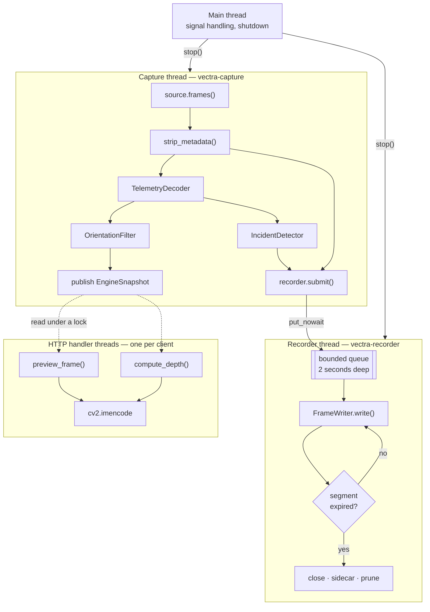
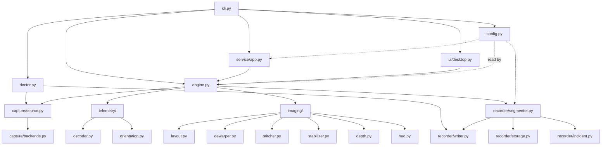
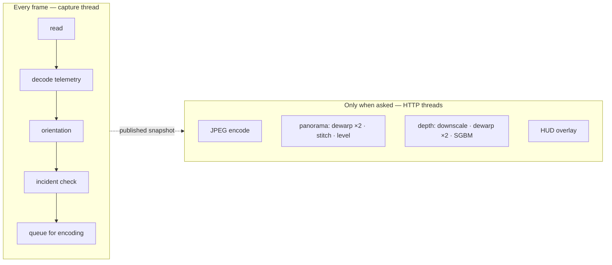

# Architecture

How Vectra-180 is put together, and why. Everything here follows from two rules.

## The two rules

**Recording is the duty.** A dashcam that drops a frame during an accident has
failed at the only job that matters. Preview, depth, the panorama and the web UI
are conveniences. So the capture loop does the minimum, and every optional cost
is pushed onto another thread — where it can be slow, or fail, without touching
the footage.

**The frame carries the clock.** A Raspberry Pi has no battery-backed clock. It
boots believing it is January 1970 and jumps to the real date the moment NTP
answers, which can be a minute into a drive. Anything measuring *duration* from
the wall clock would see that jump as a fifty-year-long segment.

So `Frame` carries both times, and each has one job:

| Time | Source | Used for |
|---|---|---|
| `Frame.monotonic` | `time.monotonic()` | Frame pacing, segment length, incident cooldown, frame-rate averaging |
| `Frame.wall_time` | `time.time()` | Clip filenames, sidecar timestamps, the burned-in overlay |

Nothing in the pipeline calls `time.time()` for a measurement. That discipline
is also what makes the suite fast: a fake source can hand over an hour of
"footage" with chosen timestamps in milliseconds.

## Threads

Three, plus one per HTTP client.



The capture thread is a daemon, so a hung camera read cannot keep the process
alive at shutdown. The recorder thread is joined with a timeout, because it has
a file to finalise and an unclosed MP4 has no `moov` atom — an unplayable clip.

### The queue is the shock absorber

`SegmentRecorder.submit()` never blocks. It is `put_nowait` onto a queue holding
roughly two seconds of frames; when that fills, the frame is dropped and
`dropped_frames` is incremented.

That is a deliberate trade. On a CM5 there is no hardware H.264 encoder — libx264
runs on the Cortex-A76 cores — so encoding is always the slowest step. A blocking
handoff would push encoder jitter back into the camera read and desynchronise
capture. An unbounded queue would ride out the jitter and then exhaust memory on
a sustained stall, which for a dashcam means recording nothing at all.

Dropped frames are visible in `/api/status`, on the HUD, and in `vectra180 doctor`.

## Module map



`config.py` has no dependencies on anything else in the package — it is read by
everyone and reads nobody, which is what makes it testable in isolation and
importable from a shell one-liner during installation.

## One frame, end to end

The sensor hands over a single wide image containing both fisheye views side by
side, with a narrow strip of non-image pixels down the left edge carrying the
IMU block.

```mermaid
sequenceDiagram
    participant Cam as CameraSource
    participant Eng as Engine._process
    participant Dec as TelemetryDecoder
    participant Det as IncidentDetector
    participant Rec as SegmentRecorder
    participant Snap as published snapshot

    Cam->>Eng: Frame(image, index, monotonic, wall_time)
    Eng->>Eng: strip_metadata() → picture, strip
    Eng->>Dec: decode_strip(strip)
    Dec-->>Eng: TelemetrySample or None
    Eng->>Eng: dt from monotonic; guard 1e-4..1.0 s
    Eng->>Eng: OrientationFilter.update(sample, dt)
    Eng->>Det: update(sample, monotonic)
    alt acceleration crosses the threshold
        Det-->>Eng: Incident
        Eng->>Rec: lock_current(source)
    end
    opt recorder running
        Eng->>Eng: crop_to_even() + burn local timestamp
        Eng->>Rec: submit(image, monotonic, wall_time, sample)
    end
    Eng->>Snap: publish EngineSnapshot under a lock
```

The published snapshot is **clean** — no burned timestamp, no HUD. The timestamp
is drawn on a copy destined for the encoder, because burned text inside a
disparity computation would be matched as scene content.

### The dt guard

If `dt` falls outside 0.1 ms to 1 s, the orientation filter is told to skip
rather than integrate. Outside that window the interval is not a frame interval:
it is the first frame after start-up, a stall, or a clock that moved. Integrating
a bogus interval throws the attitude estimate away for several seconds.

## What runs on request, and what never does



`compute_depth` is the expensive one — two dewarps and a semi-global block match.
It is never called from the capture loop and never cached on the recording path.
The desktop panel recomputes it at most four times a second; the HTTP service
computes it once per request to `/depth.jpg`.

The panorama is cheaper but not free, so it too is opt-in: `?view=pano` on
`/snapshot.jpg` and `/stream.mjpg`. Each eye is shrunk to viewing size *before*
being dewarped, since the remap dominates the cost.

## What gets recorded

The raw side-by-side frame, minus the metadata strip, cropped to even dimensions
(H.264 requires it), with an optional local-time stamp burned into a bar at the
bottom.

Deliberately **not** the panorama. Dewarping is lossy and its parameters are a
guess about your lens; the recording should be as close to what the sensor saw as
possible, because that is the version worth arguing over after a collision. The
panorama can always be produced later from the raw clip. The raw clip cannot be
recovered from the panorama.

## Failure behaviour

| Failure | What happens |
|---|---|
| Camera unplugged mid-drive | `read_failure_limit` consecutive failed reads → close, wait `reconnect_delay`, reopen. Retries forever. |
| Encoder stalls | Queue fills, frames dropped and counted; capture rate is unaffected. |
| A segment fails to write | The file is discarded, the error is recorded in `stats.last_error`, and a fresh segment opens on the next frame. The session continues. |
| Card fills up | `prune()` deletes the oldest loop clips until both the size budget and the free-space floor are satisfied. Locked clips are never touched by that pass. |
| Power cut | Only the segment in flight is lost — that is what fixed-length segments buy. |
| Sidecar write fails | Logged and ignored. A missing sidecar must never cost you the video. |
| Clock jumps when NTP settles | Nothing. Durations came from the monotonic clock; only subsequent filenames change. |

## Where to read next

- [Recording and retention](recording.md) — segments, sidecars, incidents, pruning
- [Telemetry format](telemetry.md) — the IMU block, byte by byte
- [HTTP API](api.md) — every route
- [Configuration](configuration.md) — every setting
