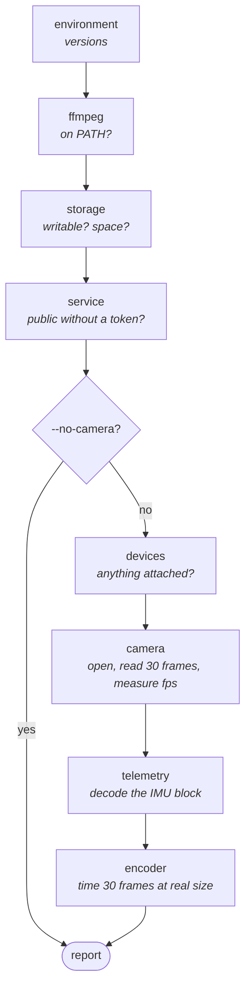

# Command line

Six subcommands. The implementation is [`cli.py`](../src/vectra180/cli.py).

```
vectra180 run       record and serve -- the systemd entry point
vectra180 view      desktop control panel (needs the 'desktop' extra)
vectra180 devices   list attached cameras
vectra180 doctor    check that this machine can actually record
vectra180 decode    read the IMU block out of a captured frame
vectra180 config    print the effective configuration
```

`vectra` is installed as a shorter alias for the same entry point — `vectra
doctor` and `vectra180 doctor` are the same command. This page uses the long
name because that is what the systemd unit invokes; type whichever you prefer.
Under [uv](https://docs.astral.sh/uv/), prefix either with `uv run`:

```bash
uv run vectra doctor
```

Nothing imports a GUI toolkit at module level, so `vectra180 run` starts on a
headless Pi with no display libraries installed. `view` is the only command that
needs the `desktop` extra, and it only imports it when you invoke it.

## Global flags

Available on every subcommand.

| Flag | Effect |
|---|---|
| `--config PATH` | TOML config file. Default: the [platform config path](configuration.md#where-the-file-lives) |
| `--camera N` | Override `camera.index` |
| `--device PATH` | Override `camera.device`, e.g. `/dev/video0` |
| `--backend NAME` | Override `camera.backend` — `auto`, `any`, `v4l2`, `dshow`, `msmf`, `avfoundation`, `gstreamer` |
| `--recording-dir PATH` | Override `recording.directory` |
| `-v`, `--verbose` | Debug logging |
| `-q`, `--quiet` | Warnings and errors only |
| `--version` | Print the version and exit (on `vectra180` itself) |

Overrides are applied **after** the file and the environment, then the whole
config is validated — so `--camera -1` is refused with one line, not a traceback.

## Exit codes

| Code | Meaning |
|---|---|
| `0` | Success |
| `1` | A check failed, a device was not found, a config value was invalid, or a file was missing |
| `130` | Interrupted with Ctrl-C |

Config errors, missing files and unknown backend names are all reported as a
**single line**, not a stack trace. They are user mistakes, not crashes.

---

## `run`

Record and serve until stopped. This is what systemd invokes.

```bash
vectra180 run
```

| Flag | Effect |
|---|---|
| `--duration SECONDS` | Stop after this long instead of running forever |
| `--no-record` | Serve the live view without writing clips |
| `--no-serve` | Record without starting the web interface |
| `--host ADDR` | Bind address. `0.0.0.0` exposes clips to the network |
| `--port PORT` | Listen port |
| `--token SECRET` | Require this token on every request |

`SIGINT` (Ctrl-C), `SIGTERM` (`systemctl stop`) and `SIGBREAK` (Ctrl-Break on
Windows) all shut down cleanly — the open segment is finalised and its sidecar
written, rather than left as a truncated file with no `moov` atom. That is why
`systemctl stop` is safe and pulling the power is not.

Shutdown is not instant: it has to close the segment being written. A second
Ctrl-C during that pause is logged and otherwise ignored, so the reflex to press
it again cannot cost you the clip.

On exit it reports what it did:

```
14:32:11 INFO    vectra180: wrote 42 segment(s), 75600 frame(s), dropped 0
```

`dropped` above zero means the encoder could not keep up. See
[Troubleshooting](troubleshooting.md#dropped-frames).

**A thirty-second smoke test**, which is the first thing to run on new hardware:

```bash
vectra180 run --duration 30 --no-serve
```

**Passing a token on the command line puts it in your shell history and in
`ps` output.** Use the config file or `VECTRA_SERVER_TOKEN` for anything
permanent; `--token` is for a one-off.

---

## `doctor`

The command to run before trusting an install. Every check exercises the **real**
path — the camera is opened, frames are read, the encoder is timed at the
resolution the camera actually produced, and the recording volume is written to.

```bash
vectra180 doctor
```

| Flag | Effect |
|---|---|
| `--no-camera` | Skip the checks that need hardware |
| `--json` | Machine-readable output |

Eight checks, in this order:



Sample output:

```
[ ok ] environment: vectra180 1.0.0 on Linux aarch64, python 3.11.2, opencv 4.10.0, numpy 2.1.1
[ ok ] ffmpeg: /usr/bin/ffmpeg
[ ok ] storage: /var/lib/vectra180/recordings: 38.4 GB free, 573 loop clip(s), 18 locked clip(s)
[ ok ] service: http://0.0.0.0:8080 (network, token required)
[ ok ] devices: v4l2[0] USB 3.0 Camera (/dev/video0) 2560x720
[ ok ] camera: 2560x720 via v4l2, 29.8 fps measured (30 requested)
[ ok ] telemetry: IMU present: 1.00 g total, gyro +0.00/-0.00/+0.01 rad/s
[warn] encoder: FFmpegWriter at 2530x720 preset 'ultrafast': 34.2 fps (30 needed)
         -> there is little headroom; a warm cabin or a background task could push it under

All critical checks passed with 1 warning(s).
```

Every non-`ok` line carries a remedy under it — the thing to actually do, not a
restatement of the problem.

**Exit code is `1` if any check `FAIL`s**, `0` if the worst is a `warn`. That
makes it usable in a provisioning script.

### What each check means

| Check | `FAIL` when | `WARN` when |
|---|---|---|
| `environment` | never | never |
| `ffmpeg` | never | not on `PATH` — the OpenCV writer will be used |
| `storage` | the directory cannot be read, or is not writable | free space is below `min_free_bytes` |
| `service` | `host` is public **and** `token` is empty | never |
| `devices` | nothing responded to a probe, or every device opened but none streamed | at least one device opened but streamed nothing |
| `camera` | it will not open, or opens and returns nothing | the driver gave a different mode than requested, or measured fps is under 80 % of requested |
| `telemetry` | never | `metadata_width` is at least as wide as the frame, or no IMU block decoded |
| `encoder` | it will not start, or it is slower than `camera.fps` | it is under 125 % of `camera.fps` — little headroom |

**The encoder check is the important one on a CM5.** There is no hardware H.264
block, so libx264 runs on the Cortex-A76 cores and 2560×720 at 30 fps is
genuinely close to the limit. Finding that out here beats finding it out from a
clip with two thirds of its frames missing.

**A telemetry warning is not a fault.** Not every dual-fisheye module embeds an
IMU block. Recording, preview, the panorama and the web UI all work without it;
only automatic incident detection needs it.

**The camera check hands its last six frames to the two checks after it**, rather
than one. The telemetry decoder accepts a sample only once a second frame
continues its timeline, so a single strip always reports nothing; and the encoder
benchmark cycles through several distinct frames so it measures the inter-frame
work it will do on the road. See
[Telemetry format](telemetry.md#telling-telemetry-from-image-data).

Use `--no-camera` to validate a config on a machine with no hardware attached —
useful in CI, or when writing a config before the camera arrives.

---

## `devices`

List capture devices that respond to a probe.

```bash
vectra180 devices
```

```
v4l2[0] USB 3.0 Camera (/dev/video0)  2560x720 @ 30fps
v4l2[2] Integrated Webcam (/dev/video2)  1280x720 @ 30fps
```

| Flag | Effect |
|---|---|
| `--max-index N` | Highest index to probe. Default `10` |
| `--json` | Machine-readable output |

Exit code `1` if nothing responded, with a hint about the `video` group on Linux.

This actually **opens** each index, which is why it takes a moment.

### Every entry names its backend

An index on its own does not name a camera. Each driver enumerates devices in
its own order, so the same number is different hardware on different backends —
on one Windows laptop MSMF numbers a USB fisheye `0` and the built-in webcam
`1`, while DirectShow numbers the pair the other way round:

```
msmf[0] Camera 0 (index 0)  4000x1200 @ 30fps
msmf[1] Camera 1 (index 1)  640x480 @ 30fps   (opened but streamed nothing -- another program may hold it)
dshow[0] Camera 0 (index 0)  640x480 @ -1fps
dshow[1] Camera 1 (index 1)  4000x1200 @ -1fps

Indices are per-backend: the same number is a different camera on a different driver.
Pin one with --backend, or camera.backend in the config.
```

Every usable driver is probed, so a camera appears once per backend that can see
it. The resolution is the reliable way to tell them apart: a dual-fisheye module
is the wide one. Pin the pair you want with `--backend`, or set `camera.backend`
in the config so it survives a reboot.

A device that **opens but streams nothing** is listed with that note rather than
omitted. That is what a camera another program is already holding looks like,
and it is worth saying rather than leaving off the list as though it were
unplugged. See [Troubleshooting](troubleshooting.md#the-wrong-camera-is-recording).

> On a Pi, prefer a stable path over an index. `/dev/video*` numbering is
> assigned in enumeration order and can move between boots; a
> `/dev/v4l/by-path/...` path names the USB socket instead and never does.
> `ls -l /dev/v4l/by-path/` will show you what is available — see
> [Configuration](configuration.md#camera) for when `by-id` is the better
> choice. `camera.device` also sidesteps the per-backend numbering above
> entirely.

---

## `decode`

Read the IMU block out of a captured frame. The way to check a camera before
trusting it — or to work out what `telemetry.metadata_width` should be.

```bash
vectra180 decode frame.jpg
```

```
frame.jpg: 2560x720
payload: 4E 61 BC 30 00 00 00 00 00 1D FD 8E 00 D2 00 15 FF F9 00 87

timestamp : 816979278
accel     :   +0.114   -9.792   +0.331  m/s^2
gyro      :   +0.002   -0.001   +0.014  rad/s
magnitude :    1.000 g
```

| Flag | Effect |
|---|---|
| `--metadata-width PX` | Width of the metadata strip. Default `30` |
| `--json` | Machine-readable output, including the raw payload hex |

Exit code `1` if no valid block was found, with the reason and what to try next.

Grab a frame to feed it with:

```bash
curl -o frame.jpg "http://127.0.0.1:8080/snapshot.jpg?overlay=0"
```

Use `overlay=0` — the HUD does not touch the metadata columns, but a clean frame
is easier to reason about. Note that a snapshot has already had the strip
removed by the engine; to inspect the strip itself, capture straight from the
device:

```bash
ffmpeg -f v4l2 -input_format mjpeg -video_size 2560x720 -i /dev/video0 -frames:v 1 raw.png
vectra180 decode raw.png
```

Use a lossless format. **JPEG will destroy the payload** — the metadata column is
not image data, and chroma subsampling and DCT quantisation will happily average
it into its neighbours.

**This command decodes the payload directly**, without the two-frame
corroboration the live pipeline applies. That guard is right for a stream and
useless for a still: a single image has no next frame, so the decoder would
reject every file this command is ever given. The trade is that `decode` can be
fooled by a strip of ordinary image data whose first eight bytes happen to look
like a plausible timestamp. If the numbers look like noise, they are.

---

## `config`

Print the effective configuration — the result of merging defaults, the file, the
environment and the flags.

```bash
vectra180 config
```

```toml
# Vectra-180 1.0.0 configuration

[camera]
index = 0
device = "/dev/video0"
width = 2560
...
```

| Flag | Effect |
|---|---|
| `--json` | JSON instead of TOML |
| `--show-secrets` | Print the auth token instead of redacting it |
| `--path` | Also report which file was read, on stderr |

The TOML output is **accepted by `--config` unchanged**, which is the point — it
is how you capture a working setup into a file:

```bash
vectra180 config > my-setup.toml
```

A redacted token is written as a **comment** rather than `token = "***"`, so the
file stays valid instead of quietly becoming the wrong password.

`--path` writes to stderr, so it does not contaminate a redirect:

```bash
vectra180 config --path > my-setup.toml
# config file: /etc/vectra180/config.toml
```

---

## `view`

The desktop control panel. Needs the `desktop` extra:

```bash
pip install "vectra-180[desktop]"
vectra180 view
```

Five view modes, selectable with keys `1`–`5`:

| Key | Mode |
|---|---|
| `1` | Panorama — both eyes dewarped, joined and levelled |
| `2` | Raw — the frame the recorder actually writes |
| `3` | Left eye |
| `4` | Right eye |
| `5` | Depth |

Live sliders adjust the stereo matcher without mutating shared state, which is
how you tune `depth.focal_scale` against your actual lens by eye.

| Key | Action |
|---|---|
| `Space` | Save a snapshot |
| `R` | Start or stop recording |
| `L` | Lock the current clip |
| `H` | Toggle the HUD |
| `Z` | Reset the horizon |
| `1`–`5` | Switch view mode |
| `Esc` · `Ctrl+Q` | Exit |

The same list is under **Help → Keyboard shortcuts**. Exiting while a recording
is running asks first, because the answer decides whether the open segment is
finalised.

This is a desk-testing tool. **Leave the extra off on a Pi** — a headless
recorder has no business installing a GUI toolkit, and `run` never imports one.

---

## Running as a service

On a Pi installed with `deploy/install-pi.sh`, the CLI lives in the service
venv and should be run as the service user:

```bash
sudo -u vectra /opt/vectra180/venv/bin/vectra180 doctor
```

Managing the unit itself:

```bash
sudo systemctl status vectra180
sudo systemctl restart vectra180
sudo journalctl -u vectra180 -f
```

Full procedure: [deploy/README.md](../deploy/README.md).

## Related

- [Configuration](configuration.md) — every setting the flags override
- [HTTP API](api.md) — what `run` serves
- [Recording and retention](recording.md) — what `run` writes
- [Troubleshooting](troubleshooting.md) — when `doctor` says something you did not expect
