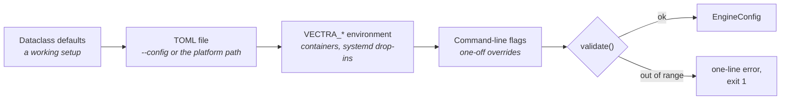

# Configuration

Every setting, its default, its environment variable and the rule it is validated
against. The authoritative source is
[`config.py`](../src/vectra180/config.py) — it has no dependencies on anything
else in the package, so it can be read on its own.

## How settings resolve

Four layers, each overriding the last.



A **missing config file is not an error** — the defaults are a working setup, and
a fresh install records without one. Passing `--config` to a file that does not
exist *is* an error, because you asked for that file specifically.

Unknown sections and unknown keys are **rejected**, not ignored. A typo in
`segment_secondss` would otherwise silently do nothing for the life of the
install, which on a dashcam means finding out months later.

Types are checked against the default they replace, and reported against the file
and key rather than surfacing as a `TypeError` from inside the engine. `enabled =
1` is rejected rather than accepted as `true`.

To see the result of the merge:

```bash
vectra180 config
```

That prints valid TOML with the token redacted — pipe it to a file and you have
captured your working setup. Add `--json` for machine-readable output, `--path`
to learn which file was read, and `--show-secrets` to print the token.

## Where the file lives

| Platform | Default path |
|---|---|
| Raspberry Pi OS / Linux | `/etc/vectra180/config.toml` if it exists, otherwise `$XDG_CONFIG_HOME/vectra180/config.toml` |
| macOS | `~/Library/Application Support/Vectra180/config.toml` |
| Windows | `%APPDATA%\Vectra180\config.toml` |

`VECTRA_CONFIG` overrides all of them, and `--config` overrides that.

A commented starting point ships as
[`deploy/config.example.toml`](../deploy/config.example.toml); the Pi installer
copies it to `/etc/vectra180/config.toml`.

---

## `[camera]`

How the dual-fisheye UVC device is opened.

| Key | Default | Environment | Notes |
|---|---|---|---|
| `index` | `0` | `VECTRA_CAMERA_INDEX` | Must be ≥ 0 |
| `device` | `""` | `VECTRA_CAMERA_DEVICE` | Explicit path, e.g. `/dev/video0`. Takes precedence over `index` |
| `width` | `2560` | `VECTRA_CAPTURE_WIDTH` | Both fisheye views side by side. Must be positive |
| `height` | `720` | `VECTRA_CAPTURE_HEIGHT` | Must be positive |
| `fps` | `30` | `VECTRA_CAPTURE_FPS` | Must be positive |
| `backend` | `"auto"` | `VECTRA_CAPTURE_BACKEND` | `auto` picks V4L2 on Linux, DirectShow on Windows, AVFoundation on macOS |
| `fourcc` | `"MJPG"` | `VECTRA_CAPTURE_FOURCC` | Exactly four characters |
| `reconnect_delay` | `2.0` | — | Seconds between reconnect attempts. Must be ≥ 0 |
| `read_failure_limit` | `30` | — | Consecutive failed reads before the source is declared disconnected. Must be ≥ 1 |

**Prefer `device` over `index` on a Pi.** `/dev/video*` numbering is assigned in
enumeration order and can move between boots if anything else claims a node
first; a `/dev/v4l/by-id/...` path never does. `vectra180 devices` lists what
responded.

**`fourcc` almost always has to stay `MJPG`.** YUYV cannot sustain 2560×720 at
30 fps over USB 2.0 — the bandwidth simply is not there — so a UVC camera asked
for YUYV at that size will silently negotiate down to something much slower.

**`read_failure_limit` is a count, not a timeout.** At 30 fps the default is
about a second of failed reads before the source closes and reopens. Reconnection
retries forever, which is the right behaviour in a car: a camera that browns out
over a speed bump should come back on its own, not end the drive.

## `[telemetry]`

Extraction of the IMU block embedded in the frame's leftmost columns. See
[Telemetry format](telemetry.md) for the wire format and the filter.

| Key | Default | Environment | Validation |
|---|---|---|---|
| `enabled` | `true` | `VECTRA_TELEMETRY_ENABLED` | — |
| `metadata_width` | `30` | `VECTRA_METADATA_WIDTH` | ≥ 0 |
| `smoothing_alpha` | `0.92` | `VECTRA_GYRO_SMOOTHING` | `[0.0, 1.0)` |
| `complementary_alpha` | `0.98` | `VECTRA_COMPLEMENTARY_ALPHA` | `[0.0, 1.0]` |
| `yaw_leak_seconds` | `20.0` | `VECTRA_YAW_LEAK_SECONDS` | ≥ 0 |
| `gravity_tolerance_g` | `0.25` | `VECTRA_GRAVITY_TOLERANCE_G` | > 0 |

`metadata_width` is the number of pixel columns cropped off the left of every
frame. Those columns are **not image data** and are removed before recording, so
getting this wrong costs you either a strip of garbage down the edge of every
clip (too small) or a slice of the left fisheye (too large). Confirm it with
`vectra180 decode` on a still before a long drive.

Setting it to `0` disables the crop entirely, which is what you want on a module
that embeds nothing.

`smoothing_alpha` is a low-pass on angular velocity: higher is smoother and
laggier. `complementary_alpha` weighs gyro integration against measured gravity —
`1.0` is gyro only and drifts, `0.0` is accelerometer only and is unusable under
vehicle acceleration. `0.98` is the usual dashcam compromise.

Both are rescaled for the real frame interval, so changing `camera.fps` does not
change how the filter behaves in seconds.

## `[recording]`

The dashcam's primary duty. See [Recording and retention](recording.md).

| Key | Default | Environment | Validation |
|---|---|---|---|
| `enabled` | `true` | `VECTRA_RECORDING_ENABLED` | — |
| `directory` | platform-dependent | `VECTRA_RECORDING_DIR` | — |
| `segment_seconds` | `60` | `VECTRA_SEGMENT_SECONDS` | ≥ 5 |
| `max_bytes` | `32 GiB` | `VECTRA_MAX_BYTES` | > 0 |
| `min_free_bytes` | `2 GiB` | `VECTRA_MIN_FREE_BYTES` | ≥ 0 |
| `max_event_bytes` | `8 GiB` | `VECTRA_MAX_EVENT_BYTES` | ≥ 0 |
| `container` | `"mp4"` | — | — |
| `encoder` | `"auto"` | `VECTRA_ENCODER` | one of `auto`, `ffmpeg`, `opencv` |
| `preset` | `"ultrafast"` | `VECTRA_ENCODER_PRESET` | — |
| `bitrate_kbps` | `8000` | `VECTRA_BITRATE_KBPS` | > 0 |
| `write_telemetry_sidecar` | `true` | — | — |
| `burn_timestamp` | `true` | `VECTRA_BURN_TIMESTAMP` | — |

Default `directory`:

| Platform | Path |
|---|---|
| Linux, with `/var/lib` present | `/var/lib/vectra180/recordings` |
| Linux otherwise | `~/vectra180-recordings` |
| macOS, Windows | `~/Videos/Vectra180` |

Clips land in `normal/` and `events/` beneath it.

**`segment_seconds` is what a power cut costs you.** Only the segment in flight
is lost when the ignition drops, so shorter segments lose less — at the price of
more container overhead and more files to walk during pruning. Sixty seconds is
the balance point for a 32 GiB budget.

**`preset` is CPU-bound on a CM5.** The Compute Module 5 has *no* hardware H.264
encoder; libx264 runs on the Cortex-A76 cores. At 2560×720 only `ultrafast` and
`superfast` keep up. Anything slower fills the recorder queue and drops frames —
which will show up as a rising `dropped_frames` in `vectra180 doctor` and on the
HUD rather than as a crash.

**`burn_timestamp` writes the time into the pixels**, in local time, in a bar at
the bottom of the frame. Container metadata does not survive a re-encode, a
screenshot or a messaging app; pixels do, and that is what makes footage useful
after an incident. The published preview snapshot is *not* stamped — burned text
inside a disparity computation would be matched as scene content.

**`max_bytes` and `max_event_bytes` are separate budgets.** The first governs
`normal/` and is pruned oldest-first. The second governs `events/`, which
ordinary pruning never touches. Both are in bytes; `32 * 1024**3` is 34 359 738
368.

## `[incident]`

| Key | Default | Environment | Validation |
|---|---|---|---|
| `enabled` | `true` | `VECTRA_INCIDENT_ENABLED` | — |
| `threshold_g` | `0.6` | `VECTRA_INCIDENT_THRESHOLD_G` | > 0 |
| `cooldown_seconds` | `10.0` | `VECTRA_INCIDENT_COOLDOWN` | ≥ 0 |
| `lock_previous_segment` | `true` | — | — |

`threshold_g` is **deviation from 1 g**, not total acceleration — the detector
compares `abs(accel_magnitude_g - 1.0)`. A stationary car reads about 0.0 by that
measure. Rough guide:

| Value | Trips on |
|---|---|
| `0.35` | Firm braking, sharp lane changes. Expect false positives on poor roads |
| `0.6` (default) | Hard braking and impacts |
| `1.0` | Impacts only |

`cooldown_seconds` suppresses further triggers so one event locks one incident
rather than a dozen. It is measured on the **monotonic** clock, so an NTP jump
mid-drive cannot extend or collapse it.

`lock_previous_segment` also protects the clip recorded immediately before the
trigger, which is where the run-up to a collision actually lives.

Incident detection needs telemetry. On a module that embeds none, this section
has no effect — but the manual lock button in the web UI still works.

## `[depth]`

Stereo depth, computed on request rather than on the recording path.

| Key | Default | Environment | Validation |
|---|---|---|---|
| `working_width` | `640` | `VECTRA_DEPTH_WIDTH` | ≥ 64 |
| `num_disparities` | `80` | `VECTRA_DEPTH_DISPARITIES` | ≥ 16 |
| `block_size` | `7` | `VECTRA_DEPTH_BLOCK_SIZE` | ≥ 3 |
| `uniqueness_ratio` | `10` | `VECTRA_DEPTH_UNIQUENESS` | — |
| `focal_scale` | `0.5` | `VECTRA_FOCAL_SCALE` | `(0.0, 2.0]` |

`working_width` is the dominant cost knob — semi-global block matching scales
roughly with pixel count times disparity range. Frames are downscaled to it
before matching.

`num_disparities` sets how close an object can be before it falls out of range;
OpenCV requires a multiple of 16. `focal_scale` is the fisheye focal length as a
fraction of frame width and is what the dewarp's intrinsic matrix is built from —
it is the one value worth tuning against your actual lens, by eye, in the desktop
panel's live sliders.

## `[server]`

| Key | Default | Environment | Validation |
|---|---|---|---|
| `enabled` | `true` | `VECTRA_SERVER_ENABLED` | — |
| `host` | `"127.0.0.1"` | `VECTRA_SERVER_HOST` | — |
| `port` | `8080` | `VECTRA_SERVER_PORT` | `1..65535` |
| `token` | `""` | `VECTRA_SERVER_TOKEN` | — |
| `preview_quality` | `70` | `VECTRA_PREVIEW_QUALITY` | `1..100` |
| `preview_fps` | `10` | `VECTRA_PREVIEW_FPS` | ≥ 1 |
| `preview_width` | `960` | `VECTRA_PREVIEW_WIDTH` | ≥ 160 |

> **Recorded footage is sensitive.** The default binds to loopback only. Changing
> `host` to `0.0.0.0` publishes every clip you have ever recorded to everyone on
> the network. Set `token` in the same edit, and file-protect the config —
> `chmod 600` — because the token lives in it.
>
> `vectra180 doctor` fails its `service` check if `host` is public and `token` is
> empty. That is not advice; it is the exit code.

The token is accepted as `Authorization: Bearer <token>` or `?token=<token>`. The
query form exists because an `` cannot carry a header, and it means the
token appears in browser history — one more reason not to reuse a password here.

`/healthz` answers without a token so a monitor can watch the service without
holding your secret.

`preview_fps` is deliberately low. Preview costs a JPEG encode per frame per
viewer, on HTTP handler threads; keeping it at 10 means several phones watching
at once still cannot starve the recorder.

## Environment variables at a glance

Useful for containers and systemd drop-ins, where a file is awkward.

```
VECTRA_CONFIG                  VECTRA_RECORDING_ENABLED     VECTRA_INCIDENT_ENABLED
VECTRA_CAMERA_INDEX            VECTRA_RECORDING_DIR         VECTRA_INCIDENT_THRESHOLD_G
VECTRA_CAMERA_DEVICE           VECTRA_SEGMENT_SECONDS       VECTRA_INCIDENT_COOLDOWN
VECTRA_CAPTURE_WIDTH           VECTRA_MAX_BYTES             VECTRA_DEPTH_WIDTH
VECTRA_CAPTURE_HEIGHT          VECTRA_MIN_FREE_BYTES        VECTRA_DEPTH_DISPARITIES
VECTRA_CAPTURE_FPS             VECTRA_MAX_EVENT_BYTES       VECTRA_DEPTH_BLOCK_SIZE
VECTRA_CAPTURE_BACKEND         VECTRA_ENCODER               VECTRA_DEPTH_UNIQUENESS
VECTRA_CAPTURE_FOURCC          VECTRA_ENCODER_PRESET        VECTRA_FOCAL_SCALE
VECTRA_TELEMETRY_ENABLED       VECTRA_BITRATE_KBPS          VECTRA_SERVER_ENABLED
VECTRA_METADATA_WIDTH          VECTRA_BURN_TIMESTAMP        VECTRA_SERVER_HOST
VECTRA_GYRO_SMOOTHING                                       VECTRA_SERVER_PORT
VECTRA_COMPLEMENTARY_ALPHA                                  VECTRA_SERVER_TOKEN
VECTRA_YAW_LEAK_SECONDS                                     VECTRA_PREVIEW_QUALITY
VECTRA_GRAVITY_TOLERANCE_G                                  VECTRA_PREVIEW_FPS
                                                            VECTRA_PREVIEW_WIDTH
```

Booleans accept `1/true/yes/on` and `0/false/no/off`; anything else is an error
rather than a silent `false`.

A handful of keys have no environment variable — `camera.reconnect_delay`,
`camera.read_failure_limit`, `recording.container`,
`recording.write_telemetry_sidecar` and `incident.lock_previous_segment`. Set
those in the TOML file.

## Command-line overrides

Applied last, on top of everything above. Available on every subcommand:

| Flag | Overrides |
|---|---|
| `--config PATH` | which TOML file is read |
| `--camera N` | `camera.index` |
| `--device PATH` | `camera.device` |
| `--recording-dir PATH` | `recording.directory` |

And on `run` specifically: `--host`, `--port`, `--token`, `--no-record`,
`--no-serve`. See [Command line](cli.md).

## A worked example

`/etc/vectra180/config.toml` for a CM5 in a car, reachable from a phone:

```toml
[camera]
device = "/dev/v4l/by-id/usb-Dual_Fisheye_Camera-video-index0"
width = 2560
height = 720
fps = 30

[telemetry]
metadata_width = 30

[recording]
directory = "/var/lib/vectra180/recordings"
segment_seconds = 60
max_bytes = 51539607552      # 48 GiB of loop footage
min_free_bytes = 2147483648  # leave 2 GiB on the card
max_event_bytes = 8589934592 # 8 GiB the loop can never reclaim
preset = "ultrafast"         # the CM5 has no hardware encoder
bitrate_kbps = 10000

[incident]
threshold_g = 0.6
cooldown_seconds = 10.0

[server]
host = "0.0.0.0"             # reachable from the phone -- and everyone else
token = "a-long-random-secret"
preview_fps = 10
```

Then, because that file now holds a secret:

```bash
sudo chmod 600 /etc/vectra180/config.toml && sudo chown vectra:vectra /etc/vectra180/config.toml
```

Confirm the merge did what you meant, and that the machine can actually record:

```bash
sudo -u vectra /opt/vectra180/venv/bin/vectra180 config && sudo -u vectra /opt/vectra180/venv/bin/vectra180 doctor
```

## Related

- [Command line](cli.md) — flags, and what each subcommand does
- [Recording and retention](recording.md) — what the storage budgets actually do
- [Telemetry format](telemetry.md) — the filter constants in context
- [Deployment runbook](../deploy/README.md) — hardware, power, phone access
- [Troubleshooting](troubleshooting.md) — when a setting does not do what you expected
