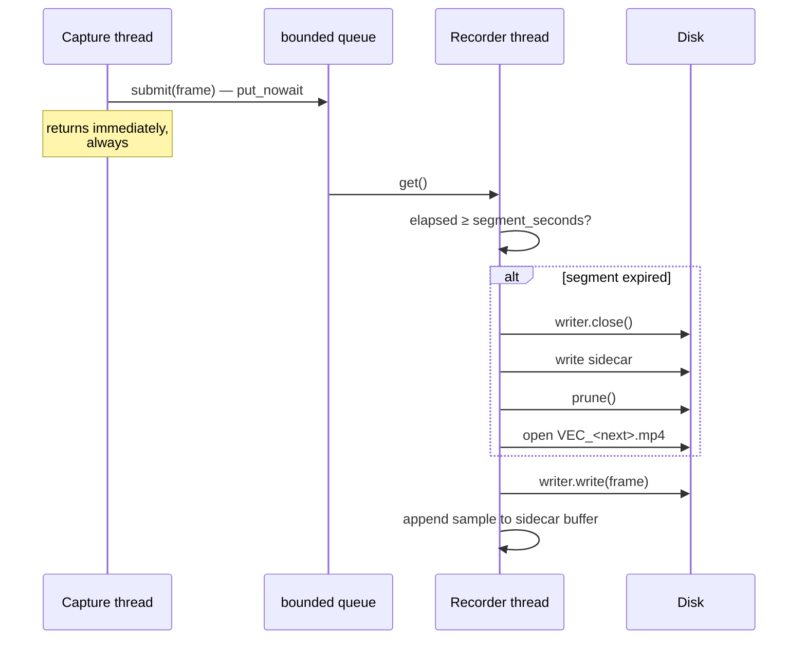
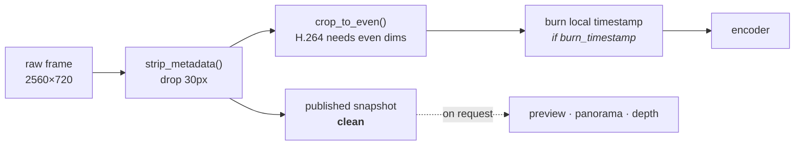
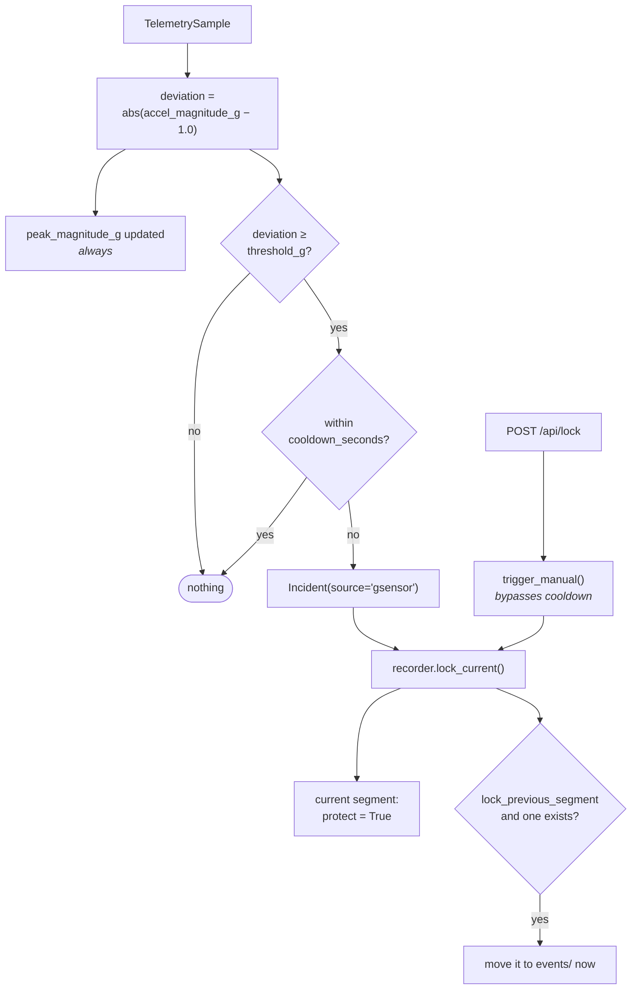
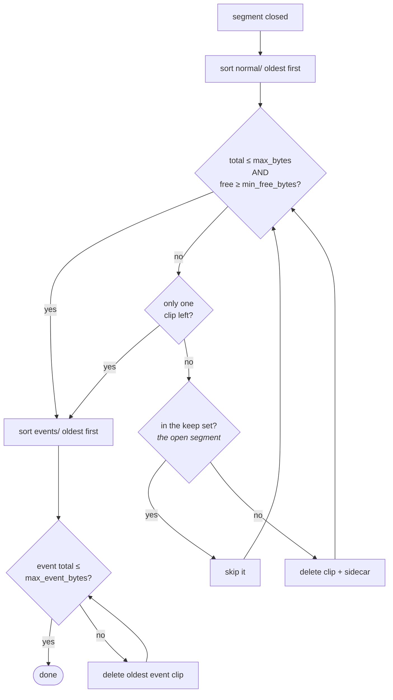

# Recording and retention

Recording is the duty. Everything in this document exists to make one guarantee
hold: **the footage you needed is still on the card when you go looking for it.**

## On disk

```
recording.directory/
├── normal/
│   ├── VEC_20260809_142530.mp4     loop footage
│   ├── VEC_20260809_142530.json    telemetry sidecar
│   ├── VEC_20260809_142630.mp4
│   └── VEC_20260809_142630.json
└── events/
    ├── VEC_20260809_141805.mp4     locked -- the loop cannot reclaim this
    └── VEC_20260809_141805.json
```

Clip names carry a **UTC** timestamp: `VEC_YYYYMMDD_HHMMSS.mp4`. A restart within
the same second appends `_1`, `_2` and so on, so the segment just written is
never reopened and truncated.

Names are the source of truth for ordering, not mtime. A Pi has no
battery-backed clock, so every file written before NTP settles carries a bogus
mtime — but the name was chosen from the frame's own wall time and sorts
chronologically by construction.

Anything in these directories that does not match
`^VEC_(\d{8})_(\d{6})(?:_[A-Za-z0-9-]+)?\.(mp4|mkv|avi)\Z` is ignored entirely.
Your own files are never listed, never counted against a budget, and never
deleted by the pruner.

> The **burned-in** timestamp is in **local** time; the **file name** is UTC.
> That is deliberate — the name has to sort and be unambiguous, while the pixels
> have to be readable by a person who was there.

## Segments

Footage is written as fixed-length clips rather than one long file. That bounds
what a power cut can destroy to the segment in flight, and it gives retention
something to delete that is never the file currently being written.

Segment length is measured on the **monotonic** clock:

```python
item.monotonic - segment.started_monotonic >= config.segment_seconds
```

An NTP jump mid-drive therefore cannot produce a fifty-year segment, or cut one
short.



### The queue never blocks

`submit()` is `put_nowait` onto a queue holding roughly two seconds of frames
(`max(2, int(fps * 2.0))`). When it fills, the frame is dropped and
`dropped_frames` is incremented.

That is the trade. Encoding is always the slowest step on a CM5 — there is no
hardware H.264 block, so libx264 runs on the Cortex-A76 cores. A blocking handoff
would push encoder jitter back into the camera read; an unbounded queue would
ride out the jitter and then exhaust memory on a sustained stall, and a dashcam
that runs out of memory records nothing at all.

A rising `dropped_frames` means the encoder cannot keep up. Lower
`camera.fps`, lower `camera.width`, or confirm `recording.preset` is
`ultrafast`. It is visible in `/api/status`, on the HUD and in `vectra180 doctor`.

## Encoders

Two backends, both writing H.264 into MP4.

| `recording.encoder` | Behaviour |
|---|---|
| `auto` (default) | Uses ffmpeg when it is on `PATH`, falls back to OpenCV when it is not |
| `ffmpeg` | ffmpeg only — never falls back |
| `opencv` | `cv2.VideoWriter` only |

`auto` falls back silently so a Pi image that lost its ffmpeg package still
records. An **explicit** choice never falls back: if you pinned a backend, a
silent substitution would hide the real problem.

ffmpeg is preferred because it accepts a bitrate target and a tuning preset, and
because it finalises the container correctly even when it is killed. Two flags in
its command line are there specifically for a car:

- `-g <fps × 2>` — a keyframe every two seconds, which bounds how much of a
  segment a corrupt write can destroy and lets a player seek.
- `-movflags +faststart` — writes the index up front, so a segment truncated by a
  power cut is still playable rather than an unseekable stub.

The OpenCV fallback uses `mp4v`, which is present in every OpenCV wheel. `avc1`
would be better but ships only where OpenCV was built against a licensed H.264
encoder. There is no bitrate control on this path.

## What gets written into the pixels



The recorded frame is the raw side-by-side picture — **not** the panorama.
Dewarping is lossy and parameterised by a guess about your lens; the recording
should be as close to what the sensor saw as possible, because that is the
version worth arguing over after a collision. A panorama can always be produced
later from the raw clip. The raw clip cannot be recovered from a panorama.

The timestamp is burned into a bar at the bottom on a **copy**. The snapshot
published for viewers is clean, because burned text inside a disparity
computation would be matched as scene content.

Set `recording.burn_timestamp = false` to turn it off — but container metadata
does not survive a re-encode, a screenshot or a messaging app, and pixels do.

## Sidecars

Every segment gets a `.json` beside it, written when the segment closes.

```json
{
  "clip": "VEC_20260809_142530.mp4",
  "started_at": "2026-08-09T14:25:30+00:00",
  "duration_seconds": 60.033,
  "frames": 1801,
  "fps": 30.0,
  "width": 2530,
  "height": 720,
  "locked": false,
  "lock_reasons": [],
  "telemetry": [
    {
      "timestamp_us": 812345678,
      "accel_x": 0.114, "accel_y": -9.792, "accel_z": 0.331,
      "gyro_x": 0.0021, "gyro_y": -0.0007, "gyro_z": 0.0135,
      "offset_seconds": 0.0
    }
  ]
}
```

| Field | Meaning |
|---|---|
| `started_at` | ISO 8601, UTC, from the first frame's wall time |
| `duration_seconds` | `frames / fps` — derived, not measured from the container |
| `locked` | Whether this clip was protected while it was being written |
| `lock_reasons` | `gsensor`, `manual`, or both |
| `telemetry` | Every sample collected during the segment, each with `offset_seconds` from the segment start |

`offset_seconds` is a **monotonic** offset, so it lines up with playback position
regardless of what the wall clock did.

A sidecar write that fails is logged and ignored. **A missing sidecar must never
cost you the video** — the clip is still listed, still playable and still
protected; only its duration reads as unknown.

Sidecars can be turned off with `recording.write_telemetry_sidecar = false`,
which also stops durations appearing in the clip browser.

## Incidents



**Magnitude, not a single axis.** The module's mounting angle in a given vehicle
is unknown, and a per-axis threshold would need recalibrating for every install.
Total acceleration reads about 1 g at rest whatever the angle, so the detector
watches how far it departs from that.

**The cooldown exists because an impact rings.** The accelerometer keeps ringing
for hundreds of milliseconds after a collision; without a cooldown one event
would fire on every frame of the ring-down and lock a whole run of segments.
Ten seconds is the default, measured on the monotonic clock.

**The previous segment is locked too.** An impact at the start of a segment
leaves the run-up — the part that actually shows what happened — in the file that
just closed. `incident.lock_previous_segment` is on by default, and that clip is
moved to `events/` immediately rather than at the next close.

**The manual button bypasses the cooldown.** A person pressing "Lock clip" means
it.

Locking marks the segment; the move to `events/` happens when the segment closes,
so a clip protected at second 3 of 60 still contains the remaining 57.

Incident detection requires telemetry. On a module that embeds no IMU block this
does nothing — but `POST /api/lock` still works, and so does the web UI's button.

## Retention

Two budgets, enforced after every segment closes.



**`normal/` is pruned against two conditions at once** — a size budget
(`max_bytes`) *and* a free-space floor (`min_free_bytes`). The floor matters
because the card is rarely dedicated to footage; the OS, logs and everything else
also need room, and a full filesystem is how a recorder stops recording.

**`events/` is never touched by that pass.** That is the entire point of locking
a clip. It has its own budget, `max_event_bytes`, applied separately and only
after the loop pass — so an install whose events directory has filled will still
prune loop footage normally.

**One clip is always left behind.** Deleting the last one frees nothing useful
and could race the writer on a nearly full card.

**The segment being written is in the keep set**, passed explicitly by the
recorder, so it can never be pruned out from under the encoder.

A clip and its sidecar are deleted together. If the video will not delete — a
read-only card, a permissions problem — the sidecar is left alone and the pruner
moves on; it never orphans a sidecar for a file that still exists.

A retention pass that raises `OSError` is logged and the recording continues. A
disk problem is not a reason to stop recording.

### Sizing the budgets

At the defaults — 2560×720, 30 fps, 8000 kbps — a segment is roughly **60 MB per
minute**, or about **3.5 GB per hour**.

| Card | Suggested `max_bytes` | Suggested `max_event_bytes` | Roughly |
|---|---|---|---|
| 64 GB | 40 GiB | 8 GiB | ~12 h loop |
| 128 GB | 96 GiB | 16 GiB | ~29 h loop |
| 256 GB | 200 GiB | 32 GiB | ~61 h loop |

Leave `min_free_bytes` at 2 GiB or more. Endurance-rated cards are worth the
money here: a dashcam writes continuously, which is the workload consumer cards
are worst at.

## Failure behaviour

| Failure | What happens |
|---|---|
| Camera unplugged mid-drive | `read_failure_limit` consecutive failed reads → close, wait `reconnect_delay`, reopen. Retries forever. |
| Encoder stalls | Queue fills, frames dropped and counted. Capture rate is unaffected. |
| A segment fails to write | The file is discarded, `stats.last_error` records why, and a fresh segment opens on the next frame. The session continues. |
| A segment produced no frames | The empty file is deleted. An empty clip occupies a retention slot and plays as broken. |
| Card fills up | Oldest loop clips are pruned until both budgets are satisfied. `events/` is untouched. |
| Power cut | Only the segment in flight is lost, and `+faststart` means even that is usually playable. |
| Sidecar write fails | Logged and ignored. The clip survives. |
| Clock jumps when NTP settles | Nothing. Durations came from the monotonic clock; only subsequent filenames change. |
| ffmpeg dies mid-segment | Its stderr is surfaced in the raised error and lands in `stats.last_error`. A new segment opens. |

## Managing clips

From the web UI: browse, download, lock, delete, and watch the storage meter.
From the API:

```bash
curl -H "Authorization: Bearer $TOKEN" http://vectra.local:8080/api/clips
curl -X POST -H "Authorization: Bearer $TOKEN" http://vectra.local:8080/api/lock
```

Every route: [HTTP API](api.md).

Clip names arriving over HTTP are validated against a **stricter** pattern than
the filesystem's — `^[A-Za-z0-9_-]+\.[A-Za-z0-9]{2,4}\Z`, no separators and no
dots beyond the extension — and are then matched against the actual inventory
rather than joined onto a path. A clip that is not in the listing does not exist,
whatever the string looks like.

## Related

- [Architecture](architecture.md) — the threads this sits on
- [Configuration](configuration.md#recording) — every recording setting
- [Telemetry format](telemetry.md) — what fills the sidecar
- [HTTP API](api.md) — listing, downloading, locking, deleting
- [Troubleshooting](troubleshooting.md) — dropped frames, missing clips, full cards
