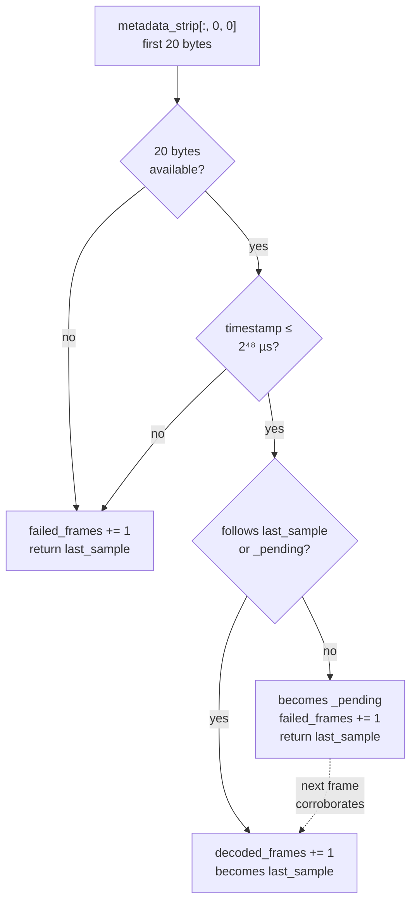
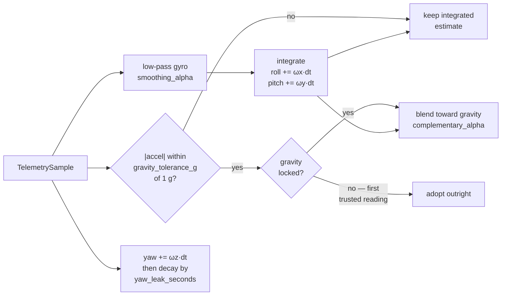

# Telemetry format

The dual-fisheye modules Vectra-180 targets carry an ICM-42688 six-axis IMU, and
the module's SoC writes a register dump into the **first pixel column of every
frame** — before the image data starts. There is no side channel, no second USB
endpoint and no timestamp negotiation: the motion data arrives inside the picture,
already synchronised to it, because it *is* the picture.

That is the single best property of this design, and the reason the codebase
treats a sample and a frame as one object. It also means cropping the metadata
strip off the left of the frame throws the telemetry away, so the crop happens
once, in [`imaging/layout.py`](../src/vectra180/imaging/layout.py), and hands
both halves back.

> **Not every module writes this block.** On one that does not, the first pixel
> column is ordinary image data. Run `vectra180 doctor` — or `vectra180 decode`
> on a still — against your hardware before you rely on any of this.

## Wire format

Twenty bytes, one per row, read from the luminance of the first column.

| Offset | Size | Encoding | Field | Units |
|---|---|---|---|---|
| 0 | 8 | `<Q` | Sensor timestamp | microseconds |
| 8 | 2 | `>h` | Accelerometer X | raw LSB |
| 10 | 2 | `>h` | Accelerometer Y | raw LSB |
| 12 | 2 | `>h` | Accelerometer Z | raw LSB |
| 14 | 2 | `>h` | Gyroscope X | raw LSB |
| 16 | 2 | `>h` | Gyroscope Y | raw LSB |
| 18 | 2 | `>h` | Gyroscope Z | raw LSB |

The **mixed endianness is not a mistake.** The SoC emits its own timestamp
little-endian, while the six sensor words are copied verbatim out of the
ICM-42688's big-endian register file. Anyone reimplementing this decoder against
a hex dump will get plausible-looking garbage if they assume one byte order
throughout, so it is worth stating twice.

## Scaling

Scaling assumes the sensor's default full-scale ranges — ±2 g and ±2000 °/s —
which is what the stock module firmware configures.

| Constant | Value | Meaning |
|---|---|---|
| `PAYLOAD_BYTES` | `20` | Total bytes read from the column |
| `ACCEL_SCALE_LSB_PER_G` | `16384.0` | LSB per g at ±2 g |
| `GYRO_SCALE_LSB_PER_DPS` | `16.4` | LSB per °/s at ±2000 °/s |
| `STANDARD_GRAVITY` | `9.80665` | m/s² per g |

A decoded [`TelemetrySample`](../src/vectra180/telemetry/decoder.py) is stored in
SI units — **acceleration in m/s², angular velocity in radians per second** — so
nothing downstream has to remember which unit it is holding. `accel_magnitude_g`
converts back to g on the way out, and reads about `1.0` when the vehicle is at
rest. That is what the incident detector thresholds against, as
`abs(magnitude - 1.0)`.

`timestamp_us` has **no fixed epoch**. It is the sensor's own uptime counter.
Treat it as monotonic within a session; never as a wall clock.

## Telling telemetry from image data

This is the part of the decoder that earns its keep.

Every one of the 65 536 possible int16 values is a physically valid reading at
those full-scale ranges, so the six sensor words can never reveal that a strip
holds picture rather than motion. Only the timestamp can, and it does so in three
stages.



**The ceiling.** `_MAX_PLAUSIBLE_TIMESTAMP_US = 1 << 48` — about 8.9 years of
microseconds. No real sensor uptime counter reaches it; eight arbitrary bytes
clear it 99.998 % of the time. That single bound is what rejects almost every
non-telemetry strip on the first frame.

**The corroboration.** Almost every is not every. Arbitrary bytes slip under the
ceiling roughly once in 65 536 frames, and *one* stray sample is enough to lock a
segment through the incident detector and throw the horizon over. So a sample is
accepted only once a second frame continues its timeline:

```
0 < candidate.timestamp_us - reference.timestamp_us <= 5_000_000
```

Five seconds (`_MAX_TIMESTAMP_GAP_US`) is comfortably past any real frame
interval, including a stalled camera, and far short of the range two unrelated
random values would land in. Two consecutive fakes that are *also* one frame
interval apart essentially never happen.

**The candidate slot.** A rejected sample is not discarded — it is kept in
`_pending`, and the next frame is checked against both `last_sample` and that
candidate. This is what lets the timeline restart after a sensor reset, a camera
reconnect or a long stall, rather than wedging the decoder against a stale
reference forever. A frame that fails to decode at all clears `_pending`, because
a broken frame breaks any candidate timeline.

The cost of all this is **one frame of startup latency**. At 30 fps that is 33 ms
before the first sample is published, in exchange for never publishing a fake one.

## From samples to attitude

[`OrientationFilter`](../src/vectra180/telemetry/orientation.py) turns the sample
stream into roll, pitch and yaw. It is a complementary filter: the gyroscope
gives responsiveness, measured gravity corrects the drift.



Three decisions in there are worth explaining.

**Gravity is ignored while manoeuvring.** Braking, cornering and potholes all add
acceleration that is not gravity. Correcting toward a total vector of 1.4 g would
tilt the horizon *into* the braking, which is exactly backwards. So a sample is
only used as a gravity reference when its magnitude is within
`gravity_tolerance_g` (default 0.25 g) of 1 g; otherwise the integrated estimate
is held.

**The first trusted reading is adopted, not eased toward.** A complementary
filter started at zero takes several time constants to reach a level attitude. On
a dashcam that means the first few seconds of every drive have a visibly wrong
horizon. `gravity_locked` makes the first in-band sample set the attitude
outright, and only subsequent ones blend.

**Yaw leaks back to zero.** Roll and pitch have an absolute reference — gravity.
Yaw does not, without a magnetometer, so integrating gyro Z alone drifts without
bound. It is bled toward zero with a 20-second time constant
(`yaw_leak_seconds`), which keeps the heading indicator useful for *rate* of turn
while refusing to pretend it is a compass. Set it to `0` to disable the leak and
accept the drift.

All three filter constants are rescaled for the actual `dt` of each frame, so
changing the frame rate does not change the filter's behaviour in seconds.

A frame that produced no sample, or a `dt` outside the engine's 0.1 ms – 1 s
guard, leaves the filter untouched: it holds the last attitude rather than
integrating a zero or a bogus interval into it.

## Where samples end up

| Destination | What it gets |
|---|---|
| HUD overlay | Raw six axes, filtered roll/pitch/yaw, artificial horizon |
| `IncidentDetector` | `accel_magnitude_g`, compared against `incident.threshold_g` |
| `HorizonStabilizer` | Filtered roll, to counter-rotate the panorama |
| JSON sidecar | Every sample collected while the segment was written |
| `GET /api/status` | The most recent sample and orientation |

The sidecar's `telemetry` array holds the flat `as_dict()` form — `timestamp_us`
plus the six axes in SI units. See [Recording and retention](recording.md) for
the rest of the sidecar's shape.

## Checking your camera

```bash
vectra180 doctor
```

The `telemetry` check opens the camera, reads a short burst of frames and reports
how many decoded. If it says none did, your module does not emit the block — the
recorder, the web UI and the panorama all still work, and the HUD simply has no
motion data to draw. Incident detection is the one feature that needs it.

To inspect a single frame you already have:

```bash
vectra180 decode frame.jpg
```

It prints the decoded sample, or tells you the strip is not telemetry. See
[Command line](cli.md#decode) for its flags.

## Related

- [Architecture](architecture.md) — where decoding sits in the capture loop
- [Recording and retention](recording.md) — sidecars and incident locking
- [Configuration](configuration.md#telemetry) — every telemetry setting
